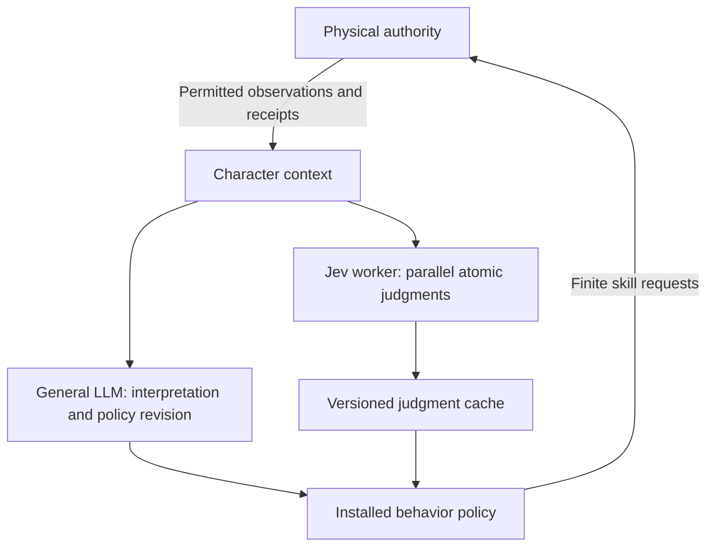

# Jev and asynchronous judgments in behavior policies

Research dated 2026-09-25. **Proposal, not an accepted architecture or implementation.** This review used primary web sources and repository source inspection. No Jev request, gameplay experiment, deployment, or performance measurement was performed.

The likely match for the described Doom video is **Jev by TypeSafe AI**. The exact video was not supplied, so its particular attack/dodge wiring remains unverified. The proposed fit is strong: retain the general LLM for interpretation and policy revision, add parallel contextual judgments to the controller, and keep physical execution under the existing authority.

**What the sources establish.** TypeSafe's [launch post](https://typesafe.ai/blog/introducing-system-one-models-and-jev) describes a Doom demo using structured textual game state, approximately 10 queries/second and about $7/hour. It reports 70–500 ms end-to-end latency, with published evaluations generally run from West Coast laptops near its service. The authors acknowledge that a conventional Doom bot could play better. These are vendor reports, not measurements for our workload. The demo demonstrates responsive instruction-conditioned control, not superior combat skill or population-scale capacity.

The [API introduction](https://docs.typesafe.ai/introduction) describes one shared state and several independently evaluated questions in one call. The [primitive contract](https://docs.typesafe.ai/primitives) offers Noul for a yes/no probability, Choice for a distribution over alternatives, and Score for ordered levels. Questions do not see one another's answers. A genuine answer dependency requires another stage; merely needing several factors does not. For us, a single actor observation could support several tactical judgments without generating a new tree each time.

TypeSafe's [confidence documentation](https://docs.typesafe.ai/confidence) distinguishes distributions from the derived confidence statistic returned for Choice and Score. Noul returns only its yes probability. Distribution sharpness is not independently established accuracy on our simulation. Type constraints do not guarantee factual correctness, coherent combinations, resistance to misleading speech, or good actions. Calibration must be measured on relevant judgments; a subjective tactical preference need not have one objectively correct label.

There is related research beyond Jev. [SayCan](https://say-can.github.io/) combines language-based task relevance with learned skill affordances. Its relevance here is separating desirability from executability; its robotics results do not validate our proposed controller. [Active Inference and Behavior Trees](https://arxiv.org/abs/2011.09756) explores probabilistic action selection with reactive trees under partial observability. Neither establishes that independently classifying every decision is universally better than joint reasoning.

**Where this fits in the current repository.** The latest [client/authority boundary](CLIENT_AUTHORITY_BOUNDARY.md) takes precedence over older descriptions of policies inside the world clock. Native controllers use a separate database; Rust workers perform inference, and a relay carries scoped observations and ordinary physical commands. The physical authority never needs access to private judgments.

| Existing component | Inspected behavior | Proposed extension |
| --- | --- | --- |
| [Policy vocabulary](../simulation/src/policy.rs) | `Condition`, `Guard`, `When`, `Priority`, `Sequence`, `Once`, actions and reconsideration | A provider-neutral condition referencing a declared judgment |
| [Controller evaluator](../simulation/src/controller/runtime.rs) | Continuous guards, entry-only conditions, durable progress, one active action and one optional dispatch per update | Read a validated judgment cache synchronously; preserve existing progress/preemption rules |
| [Guard laws](../simulation/scripts/law.rhai) and [input projection](../simulation/src/scripting/guard_input.rs) | Conditions use subjective state; optimized dependencies are tied to exact bundled source | Add explicit judgment inputs without breaking custom-law behavior or source provenance |
| [Controller storage](../server/controller/src/lib.rs) | Private actor state, separate context/history, owner-indexed inputs and journal | Bounded current judgments and pending inference metadata, separate from large context/history |
| [Participant bridge](../server/bridge/src/participant.rs) | Scoped access, observations, operations and receipts | An asynchronous decision-provider adapter and bounded scheduling |

Current `Danger` is already based on the character's belief and its source, not an omniscient world test. Jev would add contextual inference over those observations and beliefs. It would not introduce subjectivity for the first time. Older vision text mentioning `bonsai-bt` should not obscure the active simulation-owned `Node` vocabulary and controller evaluator inspected here.

**Recommended division of work.** This is a candidate design:



The general LLM can revise questions, branch priorities, risk preferences and fallback behavior within validated limits. Questions should remain tied to the character's goals and personal experience, so every actor does not become the same globally prescribed optimal fighter. A tactical judgment is a temporary assessment; it does not automatically become a durable belief, physical knowledge record, mastery or a memory inherited by a replacement character.

Use model judgments where interpretation matters: whether perceived behavior suggests hostility, whether the current approach is failing, whether an observed request warrants abandoning a task, or whether a known route seems dangerous. Keep cheap explicit tests for observed health, elapsed time and locally known resource thresholds. The authority always resolves actual range, capability, costs, legal concurrency and effects from current physical rules. A model can estimate an opportunity; it cannot certify that an attack will hit.

**Condition semantics.** A `Judgment` condition is preferable as the first addition to a new arbitrary graph engine. It references a separate declaration containing the full question, result type/options, permitted context dependencies, refresh policy, expiry and fallback. `Guard` can recheck it continuously; `When` should keep its current entry-only meaning. A Choice result can support several branches against the same cached answer.

Illustrative authoring shape, not implemented JSON or accepted numerical tuning:

```text
Judgment declaration:
  id: disengage
  question: Given my observed threat, own condition and current goal,
            is continuing this engagement an unacceptable risk to that goal?
  result: yes_probability
  enter_above: 0.75
  exit_below: 0.45
  maximum_age: chosen for this decision's useful horizon
  on_unknown: use the installed fallback branch

Priority:
  Guard(Judgment(disengage)) -> move toward a known retreat destination
  Guard(Judgment(attack_opportunity)) -> attempt the selected known attack
  otherwise -> continue the current task
```

Implementation obligations for this candidate:

1. **No waiting inside a guard.** A Rust worker assembles a bounded snapshot and batches the eligible questions for that actor. The evaluator reads the latest valid answer and always completes without a network call. Schedule watched interruption judgments even when sequential tree traversal currently short-circuits before reaching them.
2. **Preserve shared context.** Include permitted current observations, their ages, own physical state, current action, relevant personal memories/beliefs, goal and policy revision. Label hearsay and remembered state explicitly. Keep other characters' private minds and observer truth out. A single shared context per actor/request avoids resending it for every condition; putting different actors' private contexts in one prompt is not acceptable batching.
3. **Represent uncertainty separately from false.** Maintain pending, valid, expired and failed states. Boolean composition must preserve unknown (`Not(unknown)` must remain unknown), then apply an explicit fallback at the branch boundary. Do not silently convert provider errors into negative answers or automatically ask a human to resolve an NPC's uncertainty.
4. **Correlate and expire.** Bind results to run, actor, control epoch, policy/question revision, target bindings, observation cursor, snapshot time and request sequence. Reject superseded or out-of-order responses. Measure age from the input snapshot, not response arrival. Relevant changes can invalidate an answer early; unrelated world updates should not invalidate every result. Revalidate physical attempts at the authority regardless.
5. **Stabilize without hiding change.** Different enter/exit thresholds can reduce oscillation; action commitment and urgent preemption remain explicit. Hysteresis must never keep an expired assessment alive. Missing/failed judgments follow a visible installed fallback and can request later LLM reconsideration.
6. **Bound work.** Keep one active batch per actor initially, coalesce newer unsent snapshots, cap questions and request size, use global fair admission and measure queue age. Discard superseded answers, not historical evidence. Dynamic LLM-authored declarations require validation and revisioning; use fixed declarations for the first experiment.

Independent evaluation does not mean the facts, model errors or physical actions are statistically independent. Do not multiply marginal probabilities and claim a calibrated joint probability. For mutually exclusive alternatives, use one Choice or a declared priority rule. For coupled dimensions, evaluate a small set of compatible candidate bundles or stage the truly dependent choice. Preserve decomposed judgments for everything else.

In particular, **parallel judgment and simultaneous action are different changes**. Our current runtime has one active action and the world protocol starts a finite skill. Attack and retreat judgments can refresh together today in the proposed extension, while the policy chooses a branch. Concurrent movement/aim/fire would need explicit skill channels, compatibility, shared-resource accounting, cancellation and interruption rules for both human and AI controllers. Adding a parallel node alone would not establish those semantics. Dodge/projectile mechanics must be verified or implemented separately before claiming the Doom experience exists here.

**Latency and population consequences.** The [performance contract](PERFORMANCE_CONTRACT.md) requires a 16.667 ms physical step at 60 Hz. A 70–500 ms external response spans roughly 4–30 steps before controller/relay overhead. A classifier can select an evasive approach or adjust a tactical objective; a response arriving after an imminent impact cannot serve as that impact's reflex. Continuous movement and already accepted skills must proceed independently.

Start with event-triggered refresh plus a measured maximum cadence. Sweep 1, 2, 5 and 10 batches/second in experiments where useful, rather than adopting 10 Hz for every character. A one-request-at-a-time loop cannot sustain 10 Hz when responses take 500 ms. Pipelining does not make each answer fresher. The useful control horizon must exceed observation delivery, queueing, inference, dispatch and action-start latency together.

The current [published input price](https://typesafe.ai/) is $42/billion tokens ($0.042/million). The following is arithmetic assuming **1,000 total billed input tokens per batched request**, including state and questions. It is not a quote, capacity guarantee or measured token count; general LLM usage and infrastructure are additional.

| Actors using Jev | Batches per actor per second | Requests/second | Estimated inference cost/hour |
| ---: | ---: | ---: | ---: |
| 216 | 2 | 432 | $65.32 |
| 200 | 10 | 2,000 | $302.40 |
| 2,000 | 2 | 4,000 | $604.80 |
| 2,000 | 10 | 20,000 | $3,024.00 |

Formula: actors × batches/second × input tokens × 3,600 × $0.042 / 1,000,000. Costs change proportionally with token count and duty cycle. Verify access, rate limits, deployment geography, tail latency and concurrency with the provider before any large run. More conditions per batch still add tokens and local work. The approximately $7/hour Doom report uses its own payload/workload and is not a per-character price for SAO.

At 2,000 actors and 2 Hz, even one journal record per response produces 14.4 million response records/hour. Keep the active cache bounded, store immutable request context once with references, and archive exact exchanges durably. Do not copy the same response into every 60 Hz guard trace. Distinguish service RSS, active controller state, archive backlog, retained WAL and total audit storage.

**SpacetimeDB design check.** Consulted the official [documentation entry point](https://spacetimedb.com/docs/), [tables](https://spacetimedb.com/docs/tables/), [performance](https://spacetimedb.com/docs/tables/performance/), [indexes](https://spacetimedb.com/docs/tables/indexes/), [subscriptions](https://spacetimedb.com/docs/clients/subscriptions/), [views](https://spacetimedb.com/docs/functions/views/), [event tables](https://spacetimedb.com/docs/tables/event-tables/) and [2.1.0 Rust API](https://docs.rs/spacetimedb/2.1.0/spacetimedb/) before this proposal. The implications are narrow private tables, indexed actor-local access, scoped incremental delivery, small view read sets and durable recovery separate from transient notification. External inference stays outside reducers in both databases.

Authority, controller and SDK manifests/lockfile pin 2.1.0; generated shared bindings identify CLI 2.1.0. Repository evidence describes isolated 2.10.0 service experiments. This research did not inspect a running service or choose a deployment target. No newer API or event-table feature is required by the proposal. Live service/CLI compatibility remains a preflight for implementation, not a verified result here.

| Proposed data path | Reads/writes and index scope | Delivery, frequency and growth |
| --- | --- | --- |
| Context assembly | Existing permitted frame plus affected personal observations/context; owner and ordered cursor access | Existing actor-scoped subscriptions; refresh changed dependencies without world exports or all-player status regeneration |
| Judgment declarations/current results | Controller-private records by owner/run/actor and judgment ID; authenticate owner and epoch, validate revision; bounded set | One batch commit per response, only changed results; exposed to that controller and separately authorized inspection |
| Inference admission | Pending metadata per actor and indexed due work | Event/deadline driven, coalesced and globally bounded; no population scan every physics step |
| Policy consumption | Relevant cached results and local execution state | Read without inference; journal provenance/branch transitions without duplicating payloads every tick |
| Action dispatch | Existing durable outbox, sequence, action revision and receipt reconciliation | Ordinary finite commands only; no world writes for unused judgment changes and no automatic resend after uncertain delivery |
| Audit | Exact request/response, versioned context references, failures and rejected/stale responses linked to later requests/outcomes | Append at inference/transition rate, private bounded hot tail plus durable archive; reconnect restores evidence, never character knowledge automatically |

A physical judgment is controller-reported evidence. A returned probability, selected branch, admitted action and resulting hit remain distinct records. The authority's perception checks still determine what can enter the model context; spatial subscription filters are not permission checks. Recovery must restore controller progress and reconcile the physical outbox, then expire outdated judgments before choosing fresh actions.

**Experiment that would decide whether to adopt it.** First use a 4–8-character, five-minute actual-authority scenario with existing attack/move/help capabilities, varied goals, incomplete observations, a misleading report and a mid-task interruption. This is a behavior experiment, not a scale gate. Freeze initial conditions, question definitions, goals, skill/law versions, provider/model revision, context limits, call rates, deadline policy and comparison criteria before running. Repeat across several initial seeds and fresh inference runs; retain every original failure.

Compare: (A) the current deterministic-condition policy with its general LLM; (B) the same policy structure and LLM revision budget plus 3–5 parallel atomic judgments; (C) one joint tactical Choice at matched observation cadence and comparable context/cost budget. Keep policy authoring fixed first to isolate condition evaluation, then separately enable LLM question/subtree revisions. This tests the user's decomposition hypothesis against a meaningful alternative. A text-generating LLM is an optional additional latency/cost baseline, not the only comparator.

Record physical outcomes and goal progress, wasted attempts, action interruption and oscillation rates, adaptation to changed evidence, disagreement/unknown rate, accepted-answer age, missed decision horizons, provider and end-to-end p50/p95/p99 latency, tokens/cost, queue depth and exact causal chains. Evaluate calibration only where labels are defensible. Outcome differences should remain attributable to controller choices rather than changed authority rules, access or privileged observations.

Exercise timeout, malformed/provider failure, stale/out-of-order replies, policy replacement, target rebinding, disconnect/reconnect and death. A fake provider can test these contracts but cannot establish Jev behavior or throughput. Recorded-response runs can isolate integration overhead but do not establish live inference performance. Reject the candidate if it leaks private state, applies stale revisions, duplicates commands, stalls physics, or fails to improve the predeclared behavior measures enough to justify its cost.

Only after that bounded proof should it enter the existing 216-character/30-minute gate, then the 2,000-character/8-hour target with the 200-character local battle and declared observer/subscription/export load. Include world, controller and relay resources; report model inference separately as the contract requires. [Current state](CURRENT_STATE.md) leaves all those performance gates open, including the latest unmeasured iteration-49 candidate. This proposal does not reopen or claim completion of that work.

Recommendation: prototype the **provider-neutral asynchronous judgment condition** and its evidence path first. The principal hypothesis is that atomic contextual judgments improve adaptation while preserving fast installed behavior and slow LLM reflection. Simultaneous physical actions, full-population inference and general model calibration are separate questions requiring their own evidence.
