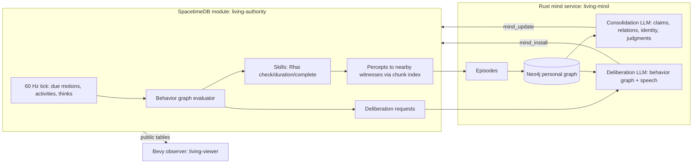

# Living core

Status: **in development** (started 2026-09-25). This is the lean replacement core agreed with the user after the scaling diagnosis below. It lives in its own Cargo workspace under [`living/`](../living) and does not modify the legacy `simulation/`, `server/` or `client/` crates. Legacy docs remain historical evidence.

## Why a new core

Diagnosis of the legacy stack (source inspection, 2026-09-25):

- The authority hydrates a Rust `World` (often from JSON text columns), clones it per tick and per action (`simulation/src/scripted_world.rs:67,368`), and writes it back. SpacetimeDB's guidance is the opposite: typed tables split by access pattern, indexed local reads and writes.
- Every rule crosses a JSON⇄Rhai boundary on the hot path, including an O(k²) per-pair visibility law (91% of observation time) and effect authorization (83% of kernel time).
- Every event is appended to a JSON audit table inside the tick (≈6.5k events/s, ≈2.7 MB/s in combat).
- Per-sender views are recomputed for every client on every tick; legacy MMO ticks still run in the same database.
- The world is one-dimensional (`position: i32`).
- The mind has no consolidation (16-item FIFO memory), beliefs are `{location, danger}`, knowledge never reaches behavior, identity drift is two scalars the behavior graph cannot read, model calls run on fixed timers, evaluators/reflection logic are duplicated, and the Neo4j concept graph is disconnected.

## Decisions (user, 2026-09-25)

| Question | Decision |
| --- | --- |
| Approach | New lean core alongside the legacy code. |
| Scripting / audit | Keep Rhai for skill rules behind a typed boundary evaluated only at action start/completion; defer the exhaustive per-event audit. Causal evidence is kept at meaningful-event granularity (chronicle, percepts, full LLM exchange journal). |
| World view | Bevy in-game observer. |
| Models | `gpt-6-luna` (Carlid endpoint) plus Mistral-served `mistral-medium-3-5` and `mistral-small-latest`, rotated across characters to compare behavior ([models.json](../living/configs/models.json)). `zai-glm-5-3` is configured but out of rotation: its thinking mode took 100–180 s per deliberation. |
| Services | SpacetimeDB 2.10.1 and Neo4j run in Docker ([compose.yml](../living/deploy/compose.yml)); only Docker and Rust are needed on the host. |

## Architecture



### Authority tables (typed, split by access pattern)

| Table | Contents | Write rate |
| --- | --- | --- |
| `world` (singleton) | seed, map size, day length, epoch | once |
| `terrain_chunk` | 16×16 terrain bytes per chunk | init / edits |
| `character` | name, kind (human/animal), controller identity, alive, birth/death | rare |
| `body` | position segment `(x,y,t, vx,vy)`, chunk, path, next event time | waypoint/chunk crossings only |
| `vitals` | hp, hunger, energy anchored at `at_ms` with current rates | on rate change / damage |
| `activity` | current skill, target, start/end | per action |
| `inventory` | `(owner, item) → qty` | per action |
| `resource_node` | kind, position, amount, lazy regrowth anchor | on gather |
| `structure` | campfire / shelter / storage | on build |
| `brain` | behavior graph JSON, revision, sequence cursors, active path, `next_think_ms` | per think (only when changed) |
| `experience` | durable per-character log of what reached the senses; minds track progress in `mind_cursor` | per event × witnesses |
| `deliberation` (private, per-controller view) | pending LLM deliberation with a scene snapshot | per trigger |
| `persona`, `relation`, `belief`, `judgment`, `place`, `thought` | mind projections for behavior and the observer | per consolidation/deliberation |
| `chronicle` | bounded story feed of notable events | per notable event |

Motion is kinematic: a body stores a straight segment and the time of its next waypoint or chunk crossing. Clients extrapolate; the server writes only at those boundaries. Needs are analytic (`value + rate × elapsed`) and settled on change. The tick processes only due rows through btree ranges on `next_*_ms`, so an idle world costs almost nothing.

### Data model: game state vs. mind (agreed 2026-09-26)

The dividing rule: **SpacetimeDB holds everything that happened or was done — including to and by minds. Neo4j holds only what a character now holds true, feels and intends, and who they are.**

| Layer | Store | Written by | Contents |
| --- | --- | --- | --- |
| World truth | SpacetimeDB | authority | bodies, needs, items, structures, resources, `chronicle` (story feed) |
| Experience | SpacetimeDB `experience` | authority only | a transactional inbox of what is new to a character: speech heard, being attacked, gifts, births, failures, meaningful own acts, bodily alarms, discoveries and first encounters. Deleted once the mind integrates it; a ~400-row window bounds it when no mind consumes. |
| Familiarity | SpacetimeDB `familiar` (private) | authority only | bodily recognition: regions visited, creatures and structures encountered (≤256 per character, least recent forgotten). Decides what is novel enough to become an experience. |
| Reasoning | SpacetimeDB `thought` (+ JSONL journal) | mind service | each LLM episode (deliberation, consolidation, birth): summary, raw reply, model, latency, tokens and a `reference` id |
| Integration progress | SpacetimeDB `mind_cursor` | mind service | experiences up to `upto` are integrated (and deleted); a restart or provider outage resumes from here |
| Mind | Neo4j | the character's own reasoning | an open graph: `:Concept {run, actor, key}` nodes with any labels and properties, relationships of any type |
| Behavior interface | SpacetimeDB `relation`, `judgment`, `place`, `persona`, `belief` | mind service | deterministic projections of the graph, fully replaced after every mind change: `self -FEELS {trust, affinity, label}-> person:<id>` → relation, `self -JUDGES {value, why}-> stance:<key>` → judgment (relaxing toward 0.5 unless reinforced), `place:<name>` with `x`, `y` → place, the self node → persona. Models may use `relations`/`judgments`/`places` shorthand arrays, which become exactly those edges. |

Mind graph conventions (the only fixed parts):

- Anchor keys tie concepts to the world: `self`, `person:<numeric id>`, `place:<name>`, `kind:<creature/resource/structure/item>`, `exp:<experience id>` (a kept memory). Any other key is the mind's own (`idea:shared_storage`, `plan:river_camp`); name-style person keys are canonicalized to ids.
- Every edge carries `confidence`, `because` (experience ids in SpacetimeDB), `thought` (the reasoning `reference`), `t`, and `open`. Changing one's mind retracts an edge (`open = false`, `valid_to`, `retracted_by`) and adds another; nothing is deleted.
- Minds change, not just grow: labels given for a concept replace its previous ones (a `Stranger` becomes a `Friend`), a null property clears it, re-asserting an edge updates its confidence and evidence, retraction closes an edge, and duplicate concepts merge (edges move to the survivor; the old concept keeps `MERGED_INTO`). Consolidation is told to look first for what new experiences contradict or update.
- Unreinforced beliefs fade: effective confidence is `c · exp(-age / 40 min)`; structural edges (`KNOWS`, `CHILD_OF`, …) do not fade. A sleep-like reorganization runs after about six integrations (or 20 minutes): faded edges close (`retracted_by = 'faded'`), then the mind merges duplicates, generalizes repeated specifics into patterns, relabels and retracts, keeping the mind compact and connected. Verified end to end against Neo4j in `minds_revise_merge_and_fade`.
- `:Memory` nodes are optional: the mind keeps only experiences it would remember, as a gist in its own words, pointing to the experience id rather than copying it.
- Identity lives on `self`; each change adds an `:IdentityVersion` via `WAS`, with the reason and the thought that caused it. Identity changes at most every 8 minutes unless an experience is momentous (salience ≥ 0.9).

Novelty at the source keeps experience volume proportional to what is new in a character's life rather than to world size: entering an unfamiliar region yields one discovery summary; a first encounter, a long-absent face, the start of a crowd or of nearby danger (with hysteresis), events (speech, attacks, gifts, births) and failures (not repeated within two minutes) become experiences; routine re-perception only refreshes familiarity. When news does repeat, integration re-asserts existing edges, which reinforces them instead of duplicating.

Decided (2026-09-26): experiences are transactional (deleted after integration; the reasoning's `thought` row and the journal keep what it meant); relations, judgments and places are derived from the graph.

Next modeling step (proposed): persistent artifacts — written tablets and signs as world state with author and time; `read` yields an experience the reader integrates as attributed testimony; later, knowledge-gated recipes so knowledge matters mechanically and can outlive its holders.

### Behavior graph

A small reactive behavior tree the mind writes as JSON and the authority validates and evaluates at ≈1 Hz per character (immediately on salient events):

- Composites: `first` (reactive priority), `seq` (remembered progress), `if/then/else` (continuous guard), `repeat`.
- Leaves: `do` (skill with a target selector; walks into range automatically), `say`, `wait`, `think` (request LLM deliberation without blocking).
- Conditions: needs, inventory, `sees`/`near` a target selector, recently hurt/heard, night, `believes` a mind-maintained judgment, `chance`, boolean combinators.
- Target selectors: nearest resource/structure/character with relation filters (`friend`, `enemy`, `stranger`, by name), remembered named places, `attacker`, `speaker`, `home`, coordinates.

Selectors only resolve entities within the character's current perception radius or its own remembered places, so the graph cannot act on observer truth.

### Mind loop

1. **Experience.** Percepts become episodes (with salience) in the actor's own Neo4j subgraph, linked to subjective concepts (people, places, things).
2. **Consolidation.** When accumulated salience crosses a personality-dependent threshold, or during sleep, the LLM turns new episodes into claims with evidence, relation changes, named places, judgments and an updated persona (narrative, values, goals, traits, mood). Revisions keep history (`REVISES`, persona versions).
3. **Deliberation.** Triggered by events (plan finished, repeated failure, being hurt, being addressed, introspection timer). Context is retrieved from the actor's graph around the concepts in the current scene. Output: a validated behavior graph, optional speech and judgments.
4. **Beliefs reach behavior** through judgments (`believes` conditions) and relations (target filters), without rewriting the graph.

### Robustness layers found necessary in live runs

- **Lenient graph front end** ([normalize.rs](../living/rules/src/normalize.rs)): models are taught flat forms (`{"if": C, "then": N}`, `{"do": "gather", "target": T}`), common slips are normalized, invalid branches are pruned with path-precise warnings fed back into the next deliberation, and a reply gets up to three attempts. Before this, most Mistral graphs and many Luna replies (brace-miscounted nested JSON) were rejected outright.
- **Body reflexes** prepended to every mind-written person graph (label `reflexes`): flee when badly hurt under attack, eat carried food or gather berries in sight when starving, sleep when exhausted. A model-written branch such as "if hungry: eat if carrying food, else wait" otherwise blocked lower branches and starved the character.
- **Deliberation hygiene**: `think` nodes are ignored for 45 s after a decision (a fresh plan otherwise re-triggered itself), addressed speech invites a reply only for questions or when the listener has not just decided, bodily alarms (starving with no food, freezing, badly hurt) request deliberation, and reasons arriving during an LLM call are kept (`updated_ms`/`seen_ms`).

### Every living thing is a character

People, deer and wolves are the same entity (`character`) with the same body machinery (needs, skills through the same Rhai rules, perception into an experience inbox) and the same mind pipeline (Neo4j mind, consolidation, deliberation). Two things vary:

- **Species profile** ([species.json](../living/seeds/species.json)), data not code: allowed skills (a wolf cannot build or give; a deer grazes), whether it speaks, a signal vocabulary (deer alarm snort and contact bleat; wolf howl, growl, whimper, hunting yips), names, a temperament range, reflexes, and cognitive pacing (animals think at most once a minute unless attacked, reflect every ten minutes, consolidate rarely, write small graphs). The normalizer and the authority prune or reject anything a body cannot do.
- **Controller**: an LLM mind, or a human client that receives the same experiences and acts through the same reducers.

Communication without words: `signal` is heard by every mind in range; a member of the same species hears "Ash makes a long howl (howl), north", others "You hear a long howl from a wolf, north". Animals hear speech as "a person's voice". Observers refer to people and their own kind by name and to other creatures by kind.

Animal minds are deliberately simple: a small model (`ministral-8b`) feels an impulse (drives, smells, associations — no language, no long plans) and remembers blunt associations; a competent model (`mistral-small`) compiles the impulse into a valid behavior graph for that body without adding wisdom the animal lacks. An unusable memory reply is redone by the competent model. Temperament (boldness, sociability, aggression, nervousness…) is rolled per individual, so animals of one species diverge.

Silence is information: addressing someone out of earshot (far away, or dead without anyone knowing) yields "No answer from Mira", so a mind can come to worry, search and eventually find remains.

### Knowledge, artifacts, trade and communities (checkpoint 2)

- **Know-how** (`know_how`) is capability, not belief: techniques gate skills in the Rhai rules; they spread by `teach` (time beside the learner), by reading a tablet or sign that describes one (literacy is itself a technique), or by `experiment` (a chance to work one out from a material, given prerequisites); they die with their last holder unless taught or written down.
- **Artifacts** (`artifact`): tablets (carried, given, stored, taken — an inventory count plus individual texts) and signs (placed structures), with author, time and text composed by the author's mind. Reading is an experience weighed as testimony.
- **Seasons**: an 8-day year; plants regrow only in growing time (`growing_ms`), winter nights are colder; cloaks (from hides) and torches (sight at night) make venturing out survivable.
- **Trade**: `offer` (give X for Y) and `accept` exchange both sides atomically or not at all.
- **Communities** (`community`, `membership`, `join_request`): founded, joined by consent (a member must `welcome`) and left; belonging shows in perception ("yours"), and taking from another community's storage is witnessed as taking from them. Their meaning, roles and rules are the members'.
- **Drives, not schedules**: restlessness (uneventful stretches, paced by curiosity) and loneliness (time without company, paced by sociability) are felt and prompt reflection; what to do about them is the mind's choice. Graphs can use `hour` conditions; a dawn moment invites reflection.
- **Laws** (perception radii, warmth distances, gestation, bonding window, crowd size, danger distances, failure-repeat window) are the Rhai `laws()` function, read once per script revision and cached, so they cost nothing per tick.

### Real-time combat

Attacks wind up (0.55–0.75 s) before they land, recording their victim; the victim is woken immediately and can perceive it (`{"threatened": true}`). `dodge` is a 2.4-tile dash at 9 tiles/s during which a landing blow misses; `block` holds a guard that takes three quarters off a hit; `throw` hurls a spear up to 7 tiles. Anyone in a fight is evaluated at combat cadence (about 15 Hz, staggered across ticks) for 8 s after the last blow, so a reaction fits inside a windup; tactics are the mind's own (no built-in auto-dodge), and a mind can patch only its labeled `combat` branch mid-fight (`"patch": {"label": "combat", "graph": …}`), keeping the rest of its plan. Combat rules (windups, damage, costs) are in the Rhai script; the defense resolution and cadence are engine primitives.

A per-tick chunk cache lets all evaluations in one tick share each chunk's bodies (positions are analytic at the tick's instant), removing repeated row decoding in crowds.

### Life course

People age (`birth_age_days` + elapsed days). Children (< 3 days) are slower and cannot build, craft, fight or conceive; elders weaken after 40 days. Two adults who both choose `conceive` toward each other within two minutes, fed and near a shelter, have a child a day later. A newborn's persona is generated by its mind from its own temperament and its parents' identities, without copying their memories. Wildlife renews while below the seed population.

## Measured authority load

Benchmark database `living-bench` on the same Docker SpacetimeDB 2.10.1 service (Apple Silicon laptop), instinct-driven people (no LLM), 96×96 map, tick duration from the module's `LogStopwatch` over a 60 s window ([bench.py](../living/tools/bench.py)); 2026-09-25:

| Characters | Ticks/s | Tick p50 | p95 | p99 | Max | Ticks > 16.7 ms | Evaluations/s |
| ---: | ---: | ---: | ---: | ---: | ---: | ---: | ---: |
| 216 + 20 animals | 59.6 | 0.88 ms | 1.66 ms | 2.26 ms | 7.6 ms | 0 of 3,792 | 306 |
| 2,000 + 20 animals | 59.7 | 5.84 ms | 7.33 ms | 8.22 ms | 12.0 ms | 0 of 3,609 | 2,655 |

| 216 mind-controlled (experiences + deliberation requests, live subscriber, no LLM answering) | 59.7 | 0.94 ms | 1.87 ms | 2.46 ms | 4.8 ms | 0 of 3,607 | 310 |
| 2,000 mind-controlled, same | 59.7 | 6.87 ms | 8.51 ms | 9.31 ms | 15.8 ms | 0 of 3,605 | 2,664 |

Mind-controlled rows write experiences inside the tick. Before bounding them, 2,000 characters on this dense map produced 5,276 experiences/s (strangers re-noticed in crowds, one row per routine success) and p99 rose to 13 ms with 17 slots over budget. Crowds of strangers are now summarized ("among a crowd of 23 people") while known people and wolves are still noticed individually, and only failures and meaningful acts (build, give, attack, …) of one's own become experiences: 8.5 experiences/s.

| 2,000 mind-controlled, with per-tick chunk cache | 59.7 | 4.79 ms | — | 6.43 ms | 8.0 ms | 0 | — |
| 200-fighter spear battle in a 14×14-tile area (+ seed world) | 59.5 | 3.27 ms | 5.25 ms | 6.41 ms | 9.8 ms | 0 of ~1,800 | 2,780 |

Before staggering combat cadence and caching chunks, the same battle ran at 51.8 ticks/s with 3% of ticks over budget (p99 18 ms).

The legacy path missed ≈48% of 60 Hz slots at 200 characters. These runs do not yet include the performance contract's full workload (sustained 30 min/8 h, 200-character battle, human clients, observer subscriptions); they establish that the per-tick work now scales with due events rather than with world size.

## Running

```bash
just living-up          # SpacetimeDB :3300 + Neo4j (:7476 browser, :7689 bolt) in Docker
just living-reset       # build the module and publish a fresh world (deletes world data)
just living-mind        # LLM minds (supervised; reconnects after module updates)
just living-web         # Bevy observer in the browser
python3 living/tools/status.py   # text snapshot of people and the story
python3 living/tools/bench.py --db living-bench --fresh --crowd 206 --seconds 60
```

`just living-publish` updates the module in place and installs the current skill rules. LLM exchanges are journaled to `.local/living/journal/<run>/<name>.jsonl`.
