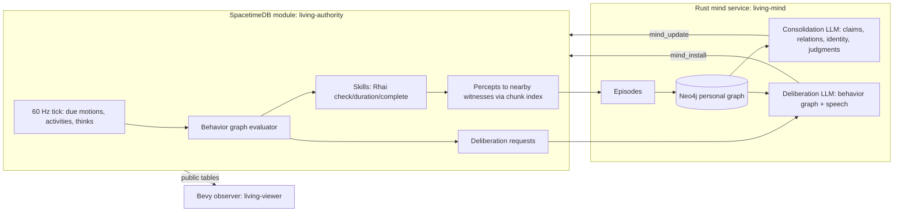

# Living core

Status: **in development** (started 2026-09-25). This is the lean replacement core agreed with the user after the scaling diagnosis below. It lives in its own Cargo workspace under [`living/`](../living) and does not modify the legacy `simulation/`, `server/` or `client/` crates. Legacy docs remain historical evidence.

## Why a new core

Diagnosis of the legacy stack (source inspection, 2026-09-25):

- The authority hydrates a Rust `World` (often from JSON text columns), clones it per tick and per action (`simulation/src/scripted_world.rs:67,368`), and writes it back. SpacetimeDB's guidance is the opposite: typed tables split by access pattern, indexed local reads and writes.
- Every rule crosses a JSON⇄Rhai boundary on the hot path, including an O(k²) per-pair visibility law (91% of observation time) and effect authorization (83% of kernel time).
- Every event is appended to a JSON audit table inside the tick (≈6.5k events/s, ≈2.7 MB/s in combat).
- Per-sender views are recomputed for every client on every tick; legacy MMO ticks still run in the same database.
- The world is one-dimensional (`position: i32`).
- The mind has no consolidation (16-item FIFO memory), beliefs are `{location, danger}`, knowledge never reaches behavior, identity drift is two scalars the behavior graph cannot read, model calls run on fixed timers, evaluators/reflection logic are duplicated, and the Neo4j concept graph is disconnected.

## Decisions (user, 2026-09-25)

| Question | Decision |
| --- | --- |
| Approach | New lean core alongside the legacy code. |
| Scripting / audit | Keep Rhai for skill rules behind a typed boundary evaluated only at action start/completion; defer the exhaustive per-event audit. Causal evidence is kept at meaningful-event granularity (chronicle, percepts, full LLM exchange journal). |
| World view | Bevy in-game observer. |
| Models | `gpt-6-luna` (Carlid endpoint) plus Mistral-served `mistral-medium-3-5` and `mistral-small-latest`, rotated across characters to compare behavior ([models.json](../living/configs/models.json)). `zai-glm-5-3` is configured but out of rotation: its thinking mode took 100–180 s per deliberation. |
| Services | SpacetimeDB 2.10.1 and Neo4j run in Docker ([compose.yml](../living/deploy/compose.yml)); only Docker and Rust are needed on the host. |

## Architecture



### Authority tables (typed, split by access pattern)

| Table | Contents | Write rate |
| --- | --- | --- |
| `world` (singleton) | seed, map size, day length, epoch | once |
| `terrain_chunk` | 16×16 terrain bytes per chunk | init / edits |
| `character` | name, kind (human/animal), controller identity, alive, birth/death | rare |
| `body` | motion segment `(x,y,t, vx,vy, heading, turn, turn_s)`, chunk, remaining coarse path corners, next steering time | steering updates only (events plus a modest cadence while moving) |
| `steer` (private) | steering goal (point, creature, direction, flight), keep distance, flags, player input bucket | when a goal changes |
| `vitals` | hp, hunger, energy anchored at `at_ms` with current rates | on rate change / damage |
| `activity` | current skill, target, start/end | per action |
| `inventory` | `(owner, item) → qty` | per action |
| `resource_node` | kind, position, amount, lazy regrowth anchor | on gather |
| `structure` | campfire / shelter / storage | on build |
| `brain` | behavior graph JSON, revision, sequence cursors, active path, `next_think_ms` | per think (only when changed) |
| `experience` | durable per-character log of what reached the senses; minds track progress in `mind_cursor` | per event × witnesses |
| `deliberation` (private, per-controller view) | pending LLM deliberation with a scene snapshot | per trigger |
| `persona`, `relation`, `belief`, `judgment`, `place`, `thought` | mind projections for behavior and the observer | per consolidation/deliberation |
| `chronicle` | bounded story feed of notable events | per notable event |

Motion is steered (see [steering locomotion](#steering-locomotion)): a body stores an analytic segment (a turn, then straight) and the time steering looks again. Clients extrapolate; the server writes only at steering updates. Needs are analytic (`value + rate × elapsed`) and settled on change. The tick processes only due rows through btree ranges on `next_*_ms`, so an idle world costs almost nothing.

### Data model: game state vs. mind (agreed 2026-09-26)

The dividing rule: **SpacetimeDB holds everything that happened or was done — including to and by minds. Neo4j holds only what a character now holds true, feels and intends, and who they are.**

| Layer | Store | Written by | Contents |
| --- | --- | --- | --- |
| World truth | SpacetimeDB | authority | bodies, needs, items, structures, resources, `chronicle` (story feed) |
| Experience | SpacetimeDB `experience` | authority only | a transactional inbox of what is new to a character: speech heard, being attacked, gifts, births, failures, meaningful own acts, bodily alarms, discoveries and first encounters. Deleted once the mind integrates it; a ~400-row window bounds it when no mind consumes. |
| Familiarity | SpacetimeDB `familiar` (private) | authority only | bodily recognition: regions visited, creatures and structures encountered (≤256 per character, least recent forgotten). Decides what is novel enough to become an experience. |
| Reasoning | SpacetimeDB `thought` (+ JSONL journal) | mind service | each LLM episode (deliberation, consolidation, birth): summary, raw reply, model, latency, tokens and a `reference` id |
| Integration progress | SpacetimeDB `mind_cursor` | mind service | experiences up to `upto` are integrated (and deleted); a restart or provider outage resumes from here |
| Mind | Neo4j | the character's own reasoning | an open graph: `:Concept {run, actor, key}` nodes with any labels and properties, relationships of any type |
| Behavior interface | SpacetimeDB `relation`, `judgment`, `place`, `persona`, `belief` | mind service | deterministic projections of the graph, fully replaced after every mind change: `self -FEELS {trust, affinity, label}-> person:<id>` → relation, `self -JUDGES {value, why}-> stance:<key>` → judgment (relaxing toward 0.5 unless reinforced), `place:<name>` with `x`, `y` → place, the self node → persona. Models may use `relations`/`judgments`/`places` shorthand arrays, which become exactly those edges. |

Mind graph conventions (the only fixed parts):

- Anchor keys tie concepts to the world: `self`, `person:<numeric id>`, `place:<name>`, `kind:<creature/resource/structure/item>`, `exp:<experience id>` (a kept memory). Any other key is the mind's own (`idea:shared_storage`, `plan:river_camp`); name-style person keys are canonicalized to ids.
- Every edge carries `confidence`, `because` (experience ids in SpacetimeDB), `thought` (the reasoning `reference`), `t`, and `open`. Changing one's mind retracts an edge (`open = false`, `valid_to`, `retracted_by`) and adds another; nothing is deleted.
- Minds change, not just grow: labels given for a concept replace its previous ones (a `Stranger` becomes a `Friend`), a null property clears it, re-asserting an edge updates its confidence and evidence, retraction closes an edge, and duplicate concepts merge (edges move to the survivor; the old concept keeps `MERGED_INTO`). Consolidation is told to look first for what new experiences contradict or update.
- Unreinforced beliefs fade: effective confidence is `c · exp(-age / 40 min)`; structural edges (`KNOWS`, `CHILD_OF`, …) do not fade. A sleep-like reorganization runs after about six integrations (or 20 minutes): faded edges close (`retracted_by = 'faded'`), then the mind merges duplicates, generalizes repeated specifics into patterns, relabels and retracts, keeping the mind compact and connected. Verified end to end against Neo4j in `minds_revise_merge_and_fade`. At the same sleep, stances (`JUDGES`) whose relaxed lean `|value − 0.5| · exp(-age / 40 min)` falls below 0.05 are no longer held (a 0.95 stance lasts about 80 minutes unless reinforced), and memories fade as `salience · exp(-age / 3 h)` from when they were formed or last recalled; below 0.15 they become `:Forgotten` (kept as history, never recalled). Measured before this (2026-09-26, read-only): stances and memories only accumulated — on realm-1 after 5 hours a mind held 65–97 open stances and 179–210 memories, growing linearly; the new rules would have closed about 60% of those stances and 27% of those memories. Verified in `recall_by_cues_and_forgetting`.
- `:Memory` nodes are optional: the mind keeps only experiences it would remember, as a gist in its own words, pointing to the experience id rather than copying it.
- Identity lives on `self`; each change adds an `:IdentityVersion` via `WAS`, with the reason and the thought that caused it. Identity changes at most every 8 minutes unless an experience is momentous (salience ≥ 0.9).

Novelty at the source keeps experience volume proportional to what is new in a character's life rather than to world size: entering an unfamiliar region yields one discovery summary; a first encounter, a long-absent face, the start of a crowd or of nearby danger (with hysteresis), events (speech, attacks, gifts, births) and failures (not repeated within two minutes) become experiences; routine re-perception only refreshes familiarity. When news does repeat, integration re-asserts existing edges, which reinforces them instead of duplicating.

Decided (2026-09-26): experiences are transactional (deleted after integration; the reasoning's `thought` row and the journal keep what it meant); relations, judgments and places are derived from the graph.

Next modeling step (proposed): persistent artifacts — written tablets and signs as world state with author and time; `read` yields an experience the reader integrates as attributed testimony; later, knowledge-gated recipes so knowledge matters mechanically and can outlive its holders.

### Behavior graph

A small reactive behavior tree the mind writes as JSON and the authority validates and evaluates at ≈1 Hz per character (immediately on salient events):

- Composites: `first` (reactive priority), `seq` (remembered progress), `if/then/else` (continuous guard), `repeat`.
- Leaves: `do` (skill with a target selector; walks into range automatically), `say`, `wait`, `think` (request LLM deliberation without blocking).
- Conditions: needs, inventory, `sees`/`near` a target selector, recently hurt/heard, night, `believes` a mind-maintained judgment, `chance`, boolean combinators.
- Target selectors: nearest resource/structure/character with relation filters (`friend`, `enemy`, `stranger`, by name), remembered named places, `attacker`, `speaker`, `home`, coordinates.

Selectors only resolve entities within the character's current perception radius or its own remembered places, so the graph cannot act on observer truth.

### Deliberate acts (experiment, 2026-09-26)

The behavior graph is the body's real-time layer (moving, keeping close, fleeing, fighting, eating, sleeping, work loops). Deliberate one-off interactions that need no sub-second reaction (starting a family, trading, giving, teaching, writing, reading, joining a community, a single piece of work, a single walk as the step before one) are *acts* a mind decides in its slow loop, like speech ([acts.rs](../living/authority/src/acts.rs), shared rules in [rules acts.rs](../living/rules/src/acts.rs)):

- A deliberation or conversation-turn reply may carry `"acts": [{"do": "conceive", "target": {"id": 6}}, ...]`, delivered through the `mind_act` reducer (authorized like the other `mind_*` reducers). Players' single `do` commands (`human_act`) take the same path.
- The authority queues them in the private `act_queue` table (at most 4) and carries each out once, in order, through `act::begin` with a dedicated `ACT` node: the same skill rules, walking into reach, checks, durations and effects as graph leaves.
- While an act runs the graph is still evaluated, but its work waits; only a reflex (flee, dodge, block, attack, throw) takes the body back and interrupts the act (what was still queued is set aside). An act gives up after 90 s without reaching its target; a queued act older than 2 minutes is dropped.
- Every outcome comes back as an `act` experience ("You did what you had decided: …", "What you had decided did not work out: …: why"); failures also prompt a thought. Ongoing or real-time skills (wander, follow, flee, fighting, wait, sleep, rest) are refused as acts with feedback.
- The deliberation scene lists what others have asked of you (a wish to start a family, a trade, a join request) and what you are waiting on; a conversation turn sees the proposals between the two speakers (the mind subscribes to `bond_offer` and `trade_offer`).
- Graph support for these skills stays (animals mate from their graph). People's starting "start a family" routine no longer conceives: it is "keep close to my partner" (approach a suitor, follow the partner).

SpacetimeDB documentation consulted: [tables](https://spacetimedb.com/docs/tables/) (private tables; split by access pattern) and [automatic migrations](https://spacetimedb.com/docs/databases/automatic-migrations/) (adding a table and a reducer is allowed). `act_queue` is written and read only by the authority, indexed by actor, a few rows per character at most; no subscriber receives it.

First lab evidence is in the [stage log](STAGES.md#stage-1).

### Mind loop

1. **Experience.** Percepts become episodes (with salience) in the actor's own Neo4j subgraph, linked to subjective concepts (people, places, things).
2. **Consolidation.** When accumulated salience crosses a personality-dependent threshold, or during sleep, the LLM turns new episodes into claims with evidence, relation changes, named places, judgments and an updated persona (narrative, values, goals, traits, mood). Revisions keep history (`REVISES`, persona versions).
3. **Deliberation.** Triggered by events (plan finished, repeated failure, being hurt, being addressed, introspection timer). What comes to mind is recalled from the actor's graph by the situation (below). Output: a validated behavior graph, optional speech and judgments.
4. **Beliefs reach behavior** through judgments (`believes` conditions) and relations (target filters), without rewriting the graph.

### Situational recall

Every reasoning episode (deliberation, conversation turn, consolidation, an animal's impulse) is given what the moment brings to mind, not the most recently written part of the mind ([recall.rs](../living/mind/src/mind/recall.rs), `Store::recall` in [memory.rs](../living/mind/src/memory.rs)):

- **Cues** come from the situation, weighted by how present they are: people and creatures perceived (closer and hurt count more), notable structures (remains, gates, signs), places the character knows within sight, people named in the reason or the latest experiences, words from the reason for thinking, what was just said or happened, the plan, the time of day and the season. A conversation turn is cued by the other person, the words said and the place; consolidation by who and what the new experiences involve and what they say.
- **Spreading activation** runs through the character's own concepts: cue keys resolve by the `(run, actor, key)` index, words match concept keys, names and memory gists (a word matching more than 8 concepts says nothing specific and is dropped), activation spreads one step along open edges weighted by effective confidence and recency, and a second, damped step from the ideas, plans and places reached. The strongest beliefs above a floor come to mind within a small budget (18 for a deliberation, 8 for a talk turn, 32 for consolidation, 10 for an animal), shared across cues so one busy person does not crowd out the rest. Recalled memories are rehearsed (`recalled_t`), which keeps them from fading.
- Feelings about people and stances keep their own prompt sections. Stances are listed when the situation touches them, when the current graph tests them (`believes`), or, if few, the most strongly held; the rest are counted ("12 other stances you hold are not on your mind now").
- Cost: 4–5 indexed Neo4j round trips, 4–15 ms per recall on realm-4 minds (p50 about 6 ms in a lab run, occasional 50–100 ms).

Audit that motivated it (realm-4, 2026-09-26, five people, their last three deliberations; read-only): the retrieval seeded `self` along with what was perceived, and `self` touches every feeling and stance, so 379 of 390 mind lines (97%) were `self -FEELS/JUDGES->` edges already listed in the relations and judgments sections, ordered by how recently they were written. Beliefs held about the moment were missing: when Zoel's baby cried, Torgar's prompt did not contain that Zovik and Niaos had promised to check on Zoel and the baby at first light (`PROMISES_TO_CHECK_ON`, held at 0.99); with a wolf in sight, Briwen's did not contain Fecor's claim that wolves threaten the eastern fields. Replaying the same moments through situational recall brings those back (the promises, the wolf memory "Wolves came within two tiles in the dark, and I fled" and the stance `wolves_nearby_at_night_are_immediate_danger`) and nothing from `self` that is not cued. Memories were the eight most recent, whatever the situation.

### Robustness layers found necessary in live runs

- **Lenient graph front end** ([normalize.rs](../living/rules/src/normalize.rs)): models are taught flat forms (`{"if": C, "then": N}`, `{"do": "gather", "target": T}`), common slips are normalized, invalid branches are pruned with path-precise warnings fed back into the next deliberation, and a reply gets up to three attempts. Before this, most Mistral graphs and many Luna replies (brace-miscounted nested JSON) were rejected outright.
- **No injected behavior** (decided with the user, 2026-09-26): a character's graph is all its body does. It starts as the species' instincts (`instincts.json`) and belongs to the character, which keeps, changes or drops any part of it; nothing eats, sleeps or flees for it. An earlier injected "body habit" layer (and animal drives) kept people and animals alive but decided for them; `own_habits` turned the layer each character had into an ordinary branch labeled `habits`. Mistakes are answered with feedback rather than correction: bodily sensations (hunger, exhaustion, cold), plan failures, fight reports, and noticing when it keeps turning back and forth between two targets. Animal minds adjust their current graph to their impulse instead of replacing it. The rules text keeps the physics of fighting and no tactics: fighting is learned by fighting.
- **Finishing work** (a rule of the behavior language, stated in the grammar minds are taught): an `if` keeps running work that completes on its own (sleep, eat, gather, build, craft, cook, teach, …) after its condition stops holding; movement and combat stay reactive. Without it, "sleep while energy < 4" woke people at 4.1 and a whole town sat at the energy floor.
- **Start guard**: a new action must be preparable, and pass its rules check when it would start on the spot, before the running one is cancelled. Without it, a higher-priority option that could not start (taking food from an empty store) cancelled the gather below it every second, and people starved standing on berry bushes.
- **Deliberation hygiene**: `think` nodes are ignored for 45 s after a decision (a fresh plan otherwise re-triggered itself), speech no longer requests deliberation (it gets conversation turns, below), bodily alarms (starving with no food, freezing, badly hurt) request deliberation, and reasons arriving during an LLM call are kept (`updated_ms`/`seen_ms`).

### Every living thing is a character

People, deer and wolves are the same entity (`character`) with the same body machinery (needs, skills through the same Rhai rules, perception into an experience inbox) and the same mind pipeline (Neo4j mind, consolidation, deliberation). Two things vary:

- **Species profile** ([species.json](../living/seeds/species.json)), data not code: allowed skills (a wolf cannot build or give; a deer grazes), whether it speaks, a signal vocabulary (deer alarm snort and contact bleat; wolf howl, growl, whimper, hunting yips), names, a temperament range, reflexes, and cognitive pacing (animals think at most once a minute unless attacked, reflect every ten minutes, consolidate rarely, write small graphs). The normalizer and the authority prune or reject anything a body cannot do.
- **Controller**: an LLM mind, or a human client that receives the same experiences and acts through the same reducers.

Communication without words: `signal` is heard by every mind in range; a member of the same species hears "Ash makes a long howl (howl), north", others "You hear a long howl from a wolf, north". Animals hear speech as "a person's voice". Observers refer to people and their own kind by name and to other creatures by kind.

Animal minds are deliberately simple: a small model (`ministral-8b`) feels an impulse (drives, smells, associations — no language, no long plans) and remembers blunt associations; a competent model (`mistral-small`) compiles the impulse into a valid behavior graph for that body without adding wisdom the animal lacks. An unusable memory reply is redone by the competent model. Temperament (boldness, sociability, aggression, nervousness…) is rolled per individual, so animals of one species diverge.

Silence is information: addressing someone out of earshot (far away, or dead without anyone knowing) yields "No answer from Mira", so a mind can come to worry, search and eventually find remains.

### Conversations (checkpoint 4, item 6, first part)

A conversation is an exchange of turns between two minds, not one line per deliberation ([talk.rs](../living/mind/src/mind/talk.rs)):

- When a person hears speech addressed to them (`to`, their name, or being the only one close by), their mind service gets a **reply turn**: a small model call (purpose `talk`, the person's own model profile; no world rules or graph grammar) with who they are (narrative, values, goals, mood), how they feel about the speaker (relation) and what they hold about them (`Store::around` on `person:<id>`), their recent non-speech experiences involving the speaker, a one-line scene (time of day, nearest remembered place, current plan) and the conversation so far. The reply is `{"thought", "say" or null, "to", "end"}`, delivered through `mind_say` with thought kind `talk`: the behavior graph is kept, and a talk turn neither clears pending deliberation reasons nor resets the deliberation clock. The other side hears the line as an ordinary experience, which gives them a turn in return.
- **Pacing from temperament** (2026-09-26): how many turns someone takes in one exchange (their stamina) follows from their sociability (1 for the most reserved, up to 6 for the most sociable), a low or bright mood and fondness for the other; their last turn is told to wrap up. A remark that asks nothing draws an answer with probability 0.3 + 0.65 × sociability/100, so the talkative answer more often than the reserved; questions always get a turn. Traits change with identity revisions, so pacing can change with experience. The talk prompt shows the temperament, how much they have talked in the last minutes, what the moment brings to mind (situational recall cued by the other person, the words said and the place) and the line being answered.
- **Closure and agreements**: each turn says what, if anything, is now `settled` ("meet at the ford at dawn", "she will think about it", "I refused") and `until` when; saying so closes the exchange. A settled pair takes no reply turns until that time comes, something happens between them that they have not already talked over (a gift, an attack, a death), or one of them brings up something new (a question or addressed line whose words are mostly new to the exchange); echoes of what was said, including a graph's repeating `say` node, do not reopen it. An exchange closed without an outcome rests for 4 hours of the day on the same terms. What was settled is the closing speaker's own conclusion, so it goes into their mind as `self -AGREED {until}-> agreement:person_<id> -WITH-> person:<id>` (one current agreement per person, restating replaces it), where recall brings it back when that person, the place or the time comes up. Otherwise an exchange stops on silence, "No answer" (out of earshot) or 12 turns, and resets after 90 s of quiet.
- Remarks addressed to nobody draw a turn only from a listener who cares about the speaker (family or close label, |affinity| ≥ 40 or trust ≥ 60), who is not in another conversation, at most once a minute per listener and one listener per remark.
- A listener whose full deliberation is pending or running gets no separate turn: the deliberation sees the line among recent experiences. Talk turns hold at most a quarter of the model slots, so deliberation is never starved.
- Conversation state is working memory in the mind service (per pair, in memory). The authority stays the record: every line is a `speak` (chronicle and experiences), so consolidation turns conversations into memories and relationship changes as before, and every turn writes a `thought` row (kind `talk`) and a journal entry.
- Saying nearly the same thing again (word overlap ≥ 60% with one's own line within 90 s) is spoken and heard like anything else; the speaker gets an experience that they said almost the same thing moments ago (feedback, not the former silent drop). Previously only addressed questions invited a reply, as a full deliberation.

Measured on a scratch database (2026-09-26; realm seed, an Oakhollow household of four and an exiled band member placed among them, five minds, 11.2 minutes spanning dusk, night and dawn, no budget; journal run `talk-1790404754`): 33 talk turns (2.9/min, 2.8k tokens/min, about 950 tokens a turn; p50 latency 0.9 s on Mistral Small, 2.8 s on Luna) against 19 deliberations (1.7/min, 12.6k tokens/min) and 25 consolidations (2.2/min, 12.8k tokens/min). Exchanges ran 6–8 turns; beside plans (berries, ledgers) they asked where the other would go beyond town, teased, and reminisced ("The oaks don't whisper. But if you listen close enough, the light hums."), and consolidation carried them into relation notes ("Invited Liise to walk to Saltmere together"). Mistral Small tends to open every line the same way ("Morning, Delga."); that is left to the model and to feedback.

Pacing, measured on scratch databases (2026-09-26; realm-4 seed, ten minds in neighbouring Harrowgate households, ids 1–10, 11–15 minutes from the first morning; old and new mind service in parallel on identical fresh worlds; Mistral returned intermittent 503s in all runs). Live realm-4 before (16.5 min chronicle window, 129 speakers): 1.8 lines/min per speaker, 64% of lines from talk turns, 3% of talk turns ending, 13% near-repeats, exchanges p90 23 and up to 73 lines, e.g. a child and a guardian settling "the gate can wait until dawn" about twenty times. Old service (two runs): 2.4 and 1.5 lines/min per speaker, 10.1 and 9.1 talk turns/min, 0 of 229 turns ended an exchange, exchanges up to 71 and 51 lines (a "Deal?"/"Deal!" loop over the sweetest berry), 11% and 3% of lines restating plans. New service (final run `talklab-new3`): 0.86 lines/min per speaker, 2.9 talk turns/min (40 turns, 54k tokens against 122k), 9 closures of which 5 with an agreement written to the mind ("carpentry lessons tomorrow at dawn", "we'll face the wolf together", "shelter work paused until morning"), 25 lines heard without a turn because the pair had settled, 4 settled exchanges reopened (3 by something new said, 1 by being taught shelter), exchanges up to 15 lines, 2% of lines restating plans; later deliberations and talk turns with that person recalled the agreement. Most remaining speech comes from deliberations (44–72% of lines in the new runs), e.g. a failing trade that re-deliberates and restates the offer each time; that is the deliberation's own speech, not a conversation turn.

### Knowledge, artifacts, trade and communities (checkpoint 2)

- **Know-how** (`know_how`) is capability, not belief: techniques gate skills in the Rhai rules; they spread by `teach` (time beside the learner), by reading a tablet or sign that describes one (literacy is itself a technique), or by `experiment` (a chance to work one out from a material, given prerequisites); they die with their last holder unless taught or written down.
- **Artifacts** (`artifact`): tablets (carried, given, stored, taken — an inventory count plus individual texts) and signs (placed structures), with author, time and text composed by the author's mind. Reading is an experience weighed as testimony.
- **Seasons**: an 8-day year; plants regrow only in growing time (`growing_ms`), winter nights are colder; cloaks (from hides) and torches (sight at night) make venturing out survivable.
- **Trade**: `offer` (give X for Y) and `accept` exchange both sides atomically or not at all.
- **Communities** (`community`, `membership`, `join_request`): founded, joined by consent (a member must `welcome`) and left; belonging shows in perception ("yours"), and taking from another community's storage is witnessed as taking from them. Their meaning, roles and rules are the members'.
- **Drives, not schedules**: restlessness (uneventful stretches, paced by curiosity) and loneliness (time without company, paced by sociability) are felt and prompt reflection; what to do about them is the mind's choice. Graphs can use `hour` conditions; a dawn moment invites reflection.
- **Laws** (perception radii, warmth distances, gestation, bonding window, crowd size, danger distances, failure-repeat window) are the Rhai `laws()` function, read once per script revision and cached, so they cost nothing per tick.

### Steering locomotion

Built 2026-09-26 after the user saw movement "pinpoint a point, get there, recompute, stop and restart". Everyone (people, animals, players) moves by steering ([motion.rs](../living/authority/src/motion.rs), geometry in [steer.rs](../living/rules/src/steer.rs)):

- **Goal, not waypoint.** A body steers for a goal kept in the private `steer` table: a point (walk, wander, approach a resource or structure), a creature (chase, approach to act, follow at a distance, walk up to someone), a direction (a player's input), or away from something (flee until a safe distance). Only point goals and blocked creature pursuits use A*; a pursuit in view steers straight at where the target is going to be (its velocity times the time to close in), and re-plans at most once a second when the way is not clear.
- **Segments are analytic.** A `body` row is a pose `(x, y, heading)` at `t_ms` with speed `|(vx, vy)|`, turning at `turn` rad/s for `turn_s` seconds (a circular arc), then straight, until `next_ms`. Authority (`common::pos`) and viewer (`body_pos`) evaluate the same `living_rules::steer::pose`, so positions are continuous across updates (measured: 99% of updates move a body less than 0.001 tile from where observers already had it).
- **A steering update** turns the heading toward the next path corner (or straight at the goal) at the `turn_rate` law, slowing for sharp turns (`turn_slow`); a standing body turns on the spot. A bend and the straight walk after it are one segment. It bends away from bodies close ahead (`separation`, `separation_weight`; not near the destination, so people still gather at a fire), cuts corners it can see past (`corner_radius`), and speeds up with the share of road just ahead (`road_speed`). The segment is swept across the map at 0.2-tile steps and ends before walls, water, rock or shut gates (then the body turns toward the wish or slides along the obstacle, and if still stuck re-plans once, then reports "the way is blocked") and just past a chunk boundary, so `chunk` stays exact for spatial queries. Shutting a gate or building a wall makes nearby moving bodies look again at once.
- **When steering looks again** (the only time `body` is written): events (the next corner, the start of the final approach, arrival, a chunk crossing, an obstacle ahead, reach of a creature) and a cadence only where it matters: every `steer_s` (2 s) at most when alone, `crowd_hz` (3 Hz) among others, `chase_hz` (4 Hz) after a moving target or away from a moving threat, `combat_hz` (8 Hz) in a fight. A still target is approached event by event.
- **No stop-and-go.** A walk reports arrival when its final approach begins (within `slow_radius`, 1.2 tiles), then glides in at about half speed and stops on the spot; the next movement, started in the meantime, takes over from the current heading and speed. Cancelling a movement coasts to a stop (a flight coasts for a second); a new goal in the same transaction keeps the momentum. Work, windups and guards still root the body (`perform` stops it), but `wait`, `eat` and `signal` do not, so they neither freeze a glide nor a player's walk. Followers stand when within `follow` reach and move on when the target does; an approach performs as soon as the target is in reach. A dodge is a dash at 9 tiles/s straight to its spot.
- **Players steer too.** `human_move(dx, dy, run)` sets a direction intent (any length; `0, 0` stops, gliding) at walking or running speed (`run_speed`), carried out by the same steering, collisions and roads. It cancels a running action, turns the plan into waiting, and repeats of the current intent cost nothing; changes are limited by a per-character token bucket (`input_hz` 30/s, `input_burst` 15). AI graphs keep their targets; an explicit "move in a direction" skill was not added (it would need the behavior grammar, which another change is editing).
- **Rules as data.** Turn rate, sharp-turn slowing, slow and corner radii, separation, cadences, run speed and input limits are `laws()` in [skills.rhai](../living/scripts/skills.rhai) (read once per script revision); walking speed stays the script's `move_speed`.

SpacetimeDB documentation consulted (2026-09-26, service and crates pinned at 2.10.1): [table performance](https://spacetimedb.com/docs/tables/performance/) (keep hot rows small and split hot from cold data; each update re-sends the row), [automatic migrations](https://spacetimedb.com/docs/databases/automatic-migrations/) and [default values](https://spacetimedb.com/docs/tables/default-values) (new columns go at the end with `#[default]`; new tables are allowed), [schedule tables](https://spacetimedb.com/docs/tables/schedule-tables) and [subscriptions](https://spacetimedb.com/docs/clients/subscriptions/). Implications: `heading`, `turn` and `turn_s` are appended to `body` with defaults, so the live `living` world can be updated in place; the goal, flags, re-plan clock and input bucket live in a private `steer` table written only when a goal changes, so the public row every observer receives stays lean and per-update writes stay one row; scheduling remains the 60 Hz tick reading due bodies through the `next_ms` btree, so cost follows steering updates, not ticks. The subscription page does not say how a row updated twice in one transaction is delivered (a replaced movement's brake and new goal land in the same reducer call); the benchmark subscriber saw one update per body per transaction.

Measured (Apple Silicon laptop, Docker SpacetimeDB 2.10.1, fresh `steer-bench` database on the realm-4 seed, 60 s windows, a live subscriber to all `body` rows counting delivered row updates; 2026-09-26; host shared with other work, load average 5–9):

| Scenario | Build | Tick p50 | p95 | p99 | Max | Ticks > 16.7 ms | Steering updates/s | `body` row updates/s | JSON kB/s to the subscriber |
| --- | --- | ---: | ---: | ---: | ---: | ---: | ---: | ---: | ---: |
| ~2,060 mind-controlled characters | before (kinematic) | 3.33–3.44 ms | 4.28–4.44 | 4.87–5.09 | 120–123 | 2–6 of ~3,200 | 496–507 | 842–857 | 308–313 |
| same | steering | 3.57–3.64 ms | 4.74–4.76 | 5.30–5.41 | 113–117 | 5 of ~3,100 | 981–1,036 | 1,308–1,421 | 603–654 |
| same, quieter host (earlier pair) | before / steering | 3.43 / 3.55 ms | 4.41 / 4.55 | 4.99 / 5.13 | 6.9 / 6.6 | 0 / 0 | 542 / 1,204 | 910 / 1,590 | 332 / 737 |
| 200-fighter battle (+ realm seed) | before | 3.01–3.20 ms | 4.64–5.12 | 5.85–6.73 | 8.4–11.3 | 0 | 185–196 | 345–391 | 126–144 |
| same | steering | 3.07–3.16 ms | 4.80–5.05 | 5.92–6.53 | 9.5–11.8 | 0 | 360–367 | 525–557 | 235–249 |

The ~115 ms maxima and the ticks over budget in the 2,000-character pairs appear in both builds (54 and 49–53 ticks/s): host stalls during those windows, not tick work; the quieter pair had none. Steering costs about 0.2 ms at p50 and 0.3 ms at p99 per tick at 2,000 characters, and about 1.6× the `body` row updates (a glide-in plus a stop per arrival instead of a stop; corners, bends and cadence in crowds and chases). Combat outcomes are unchanged in kind (blocks dominate: about 1,950 blocked, 28–46 hits and 4–23 dodges a minute in both builds). With the realm seed alone (about 260 characters, [motion_probe.py](../living/tools/motion_probe.py), both builds side by side): 0.73 against 0.43 row updates per moving body per second, abrupt direction changes (over 60° between segments) 0.26 against 1.54 per moving body per minute; short stands between movements (0.22 against 0.14 per minute) are behavior choices, mostly animals fleeing again after reaching a safe distance. Checks: `cargo test -p living-rules` (steering geometry: arcs, bounded turns, stopping at and sliding along walls, chunk boundaries, roads), [verify_steering.py](../living/tools/verify_steering.py) (two walks flow into each other with no standing row between, arrival slows, a follower keeps 1–2 tiles and keeps up, a player's input moves, turns, runs and stops, input is rate-limited) and the 10 [mechanics checks](../living/tools/verify_mechanics.py) pass.

### Real-time combat

Attacks wind up (0.55–0.75 s) before they land, recording their victim; the swinger stands still, and the blow lands only if the victim is still within reach (1.4 tiles plus a species lunge from the script: people 0.6, wolves 1.8) when the windup ends, so stepping back or running works against a person but not against a wolf; the victim is woken immediately and can perceive it (`{"threatened": true}`). `dodge` is a 2.4-tile dash at 9 tiles/s during which a landing blow misses; `block` holds a guard that takes three quarters off a hit; `throw` hurls a spear up to 7 tiles. Anyone in a fight is evaluated at combat cadence (about 15 Hz, staggered across ticks) for 8 s after the last blow, so a reaction fits inside a windup; tactics are the mind's own (no built-in auto-dodge), and a mind can patch only its labeled `combat` branch mid-fight (`"patch": {"label": "combat", "graph": …}`), keeping the rest of its plan. While people fight, each gets a short account of the exchange every ~7 s (blows taken, blocked, dodged, stepped out of reach; theirs blocked, dodged or missed) as a reason to think, so a mind can patch its `combat` branch from what actually happened. Combat rules (windups, damage, lunge, costs) are in the Rhai script; the defense and reach resolution and the cadence are engine primitives. Anyone can `tend` a wounded person (6 s, +10 health, not while the patient is fighting).

A per-tick chunk cache lets all evaluations in one tick share each chunk's bodies (positions are analytic at the tick's instant), removing repeated row decoding in crowds.

### Worlds of any size, towns and bands (checkpoint 3)

The world row carries its width and height; chunk ids are packed `(cy << 16) | cx`, so nothing depends on a fixed map. A seed's `map` selects the classic 96×96 valley or a realm of any size ([realm.rs](../living/rules/src/realm.rs): mountains in the west, a coast in the east, rivers carved downhill, fords cut so all land connects, proposed town and wild sites). Resources scale with area. A seed's `towns` are laid out at the realm's town sites: a meeting fire, households in shelters around it, two stocked storages, a ring of planted berry bushes, a ledger sign and a community. Residents get generated names, know-how that goes with their occupation's history (history, not assignment) and a `background` row (town, occupation, household, home). `bands` start in the wilds with a few berries and little or no know-how. The mind writes each resident's starting identity from their background with an individual temperament, then treats it as ordinary identity. The seed's `setting` and size are what minds are told about the world. `just living-seed realm` selects `seeds/realm.json` for the next reset.

### LLM load and priority

An optional global budget (`LIVING_LLM_PER_MIN`, off by default since the user moved to cheap models on 2026-09-26; token bucket with ~15 s burst) admits every model call. Deliberation may use the whole bucket; deferrable work (consolidation, reorganization, identities) waits while less than a quarter is left and may hold at most half of the concurrent slots (`LIVING_CONCURRENCY`, default 32). People rotate between GPT-6 Luna (also the default, and the retry for unusable replies) and Mistral Small; animals feel with Ministral and build their graphs with Mistral Small. [llm_load.py](../living/tools/llm_load.py) reports calls, tokens and latency per purpose, model and purpose × model (e.g. `purpose:talk/model:…`) from the journal; `--span` rates short experiments over their own time span. Measured on realm-1 in its first 10 minutes, before the budget (39 people, 42 animals): 79 calls/min, 456k tokens/min, deliberation p50 4.4 s; the largest sources were plans with no applicable branch re-deliberating every 25 s and reflections every 150 s, since slowed to 60 s and 240 s.

### Life course

People age (`birth_age_days` + elapsed days). Children (< 3 days) are slower and cannot build, craft, fight or conceive; elders weaken after 40 days. Two adults who both choose `conceive` toward each other within two minutes, fed and near a shelter, have a child a day later. A newborn's persona is generated by its mind from its own temperament and its parents' identities, without copying their memories. Wildlife renews while below the seed population.

## Measured authority load

Benchmark database `living-bench` on the same Docker SpacetimeDB 2.10.1 service (Apple Silicon laptop), instinct-driven people (no LLM), 96×96 map, tick duration from the module's `LogStopwatch` over a 60 s window ([bench.py](../living/tools/bench.py)); 2026-09-25:

| Characters | Ticks/s | Tick p50 | p95 | p99 | Max | Ticks > 16.7 ms | Evaluations/s |
| ---: | ---: | ---: | ---: | ---: | ---: | ---: | ---: |
| 216 + 20 animals | 59.6 | 0.88 ms | 1.66 ms | 2.26 ms | 7.6 ms | 0 of 3,792 | 306 |
| 2,000 + 20 animals | 59.7 | 5.84 ms | 7.33 ms | 8.22 ms | 12.0 ms | 0 of 3,609 | 2,655 |

| 216 mind-controlled (experiences + deliberation requests, live subscriber, no LLM answering) | 59.7 | 0.94 ms | 1.87 ms | 2.46 ms | 4.8 ms | 0 of 3,607 | 310 |
| 2,000 mind-controlled, same | 59.7 | 6.87 ms | 8.51 ms | 9.31 ms | 15.8 ms | 0 of 3,605 | 2,664 |

Mind-controlled rows write experiences inside the tick. Before bounding them, 2,000 characters on this dense map produced 5,276 experiences/s (strangers re-noticed in crowds, one row per routine success) and p99 rose to 13 ms with 17 slots over budget. Crowds of strangers are now summarized ("among a crowd of 23 people") while known people and wolves are still noticed individually, and only failures and meaningful acts (build, give, attack, …) of one's own become experiences: 8.5 experiences/s.

| 2,000 mind-controlled, with per-tick chunk cache | 59.7 | 4.79 ms | — | 6.43 ms | 8.0 ms | 0 | — |
| 200-fighter spear battle in a 14×14-tile area (+ seed world) | 59.5 | 3.27 ms | 5.25 ms | 6.41 ms | 9.8 ms | 0 of ~1,800 | 2,780 |

Before staggering combat cadence and caching chunks, the same battle ran at 51.8 ticks/s with 3% of ticks over budget (p99 18 ms).

On the 256×256 realm (checkpoint 3; 2026-09-26, same service, 60 s windows):

| Scenario | Tick p50 | p95 | p99 | Max | Ticks > 16.7 ms |
| --- | ---: | ---: | ---: | ---: | ---: |
| 2,039 mind-controlled characters spread over the realm (+ seeded towns and wildlife) | 3.56 ms | 4.60 ms | 5.17 ms | 6.7 ms | 0 of 3,606 |
| 200-fighter spear battle (+ realm seed) | 2.78 ms | 4.98 ms | 6.22 ms | 12.6 ms | 0 of 3,612 |

Each fresh 2,000-character benchmark writes gigabytes of commit log, and `--delete-data` republishes leave the old replica directories in the SpacetimeDB volume; run benchmarks against a dedicated database and watch host disk space (a full disk put the Docker VM's filesystem into read-only mode on 2026-09-26).

The legacy path missed ≈48% of 60 Hz slots at 200 characters. These runs do not yet include the performance contract's full workload (sustained 30 min/8 h, 200-character battle, human clients, observer subscriptions); they establish that the per-tick work now scales with due events rather than with world size.

## Running

```bash
just living-up          # SpacetimeDB :3300 + Neo4j (:7476 browser, :7689 bolt) in Docker
just living-reset       # build the module and publish a fresh world (deletes world data)
just living-mind        # LLM minds (supervised; reconnects after module updates)
just living-web         # Bevy observer in the browser
python3 living/tools/status.py   # text snapshot of people and the story
python3 living/tools/bench.py --db living-bench --fresh --crowd 206 --seconds 60
```

`just living-publish` updates the module in place and installs the current skill rules. LLM exchanges are journaled to `.local/living/journal/<run>/<name>.jsonl`.
