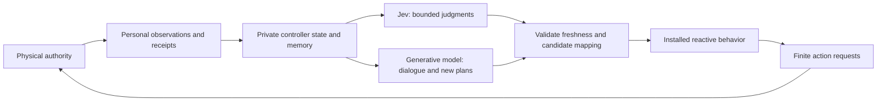

# TypeSafe / Jev NPC evaluation

2026-09-17 · branch `codex/integration-exploration` · exploratory, not performance acceptance.

Follow-up: the [actual-authority shadow trial](TYPESAFE_SHADOW_TRIAL.md) is complete.
Four of six Jev calls succeeded; two exceeded its token limit. Successful calls
took 0.526–1.175 seconds. The report below retains the earlier synthetic findings;
the live follow-up is the stronger evidence for actual participant payloads.

**Recommendation: pursue a bounded hybrid-controller experiment.** Jev looks useful
for selecting among known approaches and interpreting bounded aspects of personal
evidence. Retain a generative model for dialogue, novel plans, research/code and
open-ended reflection. Retain the existing fast controller and physical authority.
Do not replace the NPC mind with a fixed classification menu or put inference on
the 60 Hz critical path.

This review used the installed [TypeSafe skill](../.agents/skills/typesafe-ai/SKILL.md),
live official documentation, current source and **64 actual API calls**. No world
was started, published or modified. The test is a model/API screen, not a second
simulator and not an integrated NPC trial.

## What the service offers

Jev consumes text or structured state and returns **Choice** (one candidate and
its distribution), **Noul** (probability of yes), or **Score** (a weighted position
on a described ordered scale). It does not generate dialogue, code, arbitrary
new claims or reasoning explanations. Choices can have up to 255 candidates.
Independent questions about one state can share a request; they cannot condition
on one another's answers. See [System One](https://docs.typesafe.ai/concepts/system-one),
[API](https://docs.typesafe.ai/api), [Choice](https://docs.typesafe.ai/primitives/choice),
[Score](https://docs.typesafe.ai/primitives/score), and
[parallel-question cookbook](https://docs.typesafe.ai/cookbooks/parallel_questions).

The vendor advertises $0.042 per million input tokens, free output, and 70–500 ms
end-to-end responses. Its published measurements are generally from West Coast
laptops, where it says the service is based. These are vendor observations, not an
SLA or our latency results. Its game demo uses structured state, which is compatible
with our approach. See the [launch report](https://typesafe.ai/blog/introducing-system-one-models-and-jev).

The “zero hallucinations” claim concerns constrained output shape. A valid option
can still be the wrong interpretation, an inappropriate intention or stale when
received. Confidence describes the output distribution; it is not permission,
world truth or proof of calibration on our characters. Noul probability is not
emotion intensity. See [confidence](https://docs.typesafe.ai/confidence).

## Live screen and preserved results

The probe sent 16 hand-authored synthetic cases, each with three independent
questions: eight behavior cases and eight evidence cases. Two answers per case
had predefined expectations; subjective relevance/urgency Scores were retained
without a fabricated gold value. Cases included conflicting reports, an absent
friend, quoted adversarial instructions, accepted versus completed transfers,
failed healing, learning versus mastery, and an intention absent from the menu.

| Trial | Requests / concurrency | Median HTTP ms | p95 ms | Maximum ms | Expected checks matched | Input tokens |
| --- | ---: | ---: | ---: | ---: | ---: | ---: |
| Original rubric | 16 / 1 | 261.8 | 740.0 | 740.0 | 30/32 | 10,164 |
| Original rubric, repeated | 32 / 4 | 257.2 | 650.5 | 658.9 | 60/64 | 20,328 |
| Clarified evidence rubric | 16 / 1 | 270.0 | 750.5 | 750.5 | 31/32 | 10,596 |

All 64 HTTP requests succeeded and their 192 typed answers passed the probe's
shape/range validation. The first call requested `jev-latest`; the service returned
`jev-1.13.0` throughout that trial. Subsequent trials requested that version
explicitly. Total reported input usage: **41,088 tokens**, estimated input cost
**$0.001726** at the public rate. This is a usage estimate, not an invoice.

The measurement runs on this local Mac, uses a persistent HTTPS connection per
worker and includes connection establishment in each worker's first call. There
are no automatic retries, fallback models or world operations. These are
closed-loop requests with bounded concurrency, not a sustained offered-load test.
Three trial wall times were 4.94, 2.63 and 4.92 seconds. Parallelism improved batch
completion time, not individual response time. Requests used only 613–679 billed
input tokens; full NPC context and longer memory were **not** benchmarked.

Percentiles use nearest rank. With 16 samples p95 and p99 both equal the maximum;
with 32 samples p99 still equals the maximum. These are descriptive statistics,
not established production tails. Successful-response latency also excludes
observation construction, application queueing, authority admission and effect
delivery. Population, density, game action rate, subscriptions and observer/export
load were all zero. There was no service-memory or reducer-cost measurement.

### What failed and what it means

1. The original rubric repeatedly classified **lack of evidence as contradiction**:
   no witnessed death became `contradicted`, as did no practice/mastery evidence.
   Original Choice confidence was 0.67/0.65; repetition retained the same selected
   labels with changing probabilities. The separate yes/no question correctly
   assigned low probability to those claims being established. This is a semantic
   category error, not a malformed answer or an invented death effect.
2. A revised rubric explicitly distinguished a positive conflicting observation
   from missing confirmation. Both evidence cases then matched expectations.
   This is improvement on inspected cases, **not held-out generalization**.
3. The revised trial newly chose `continue` for the unchanged behavior case whose
   intended invention was outside the menu: 0.51 probability versus 0.47 for
   `reconsider`, confidence 0.39. That exposes the need to evaluate candidate
   coverage and ambiguity. Do not assert that changing the evidence rubric caused
   this: these were fresh calls, and no causal ablation establishes the reason.

No error was repaired, relabeled or overwritten. All expected checks concern the
explicit fixture instructions. They do not prescribe how every NPC must act, and
agreement rates are not “NPC intelligence” scores. No comparison against the
existing generative provider or a deterministic baseline has run.

The [probe](../experiments/typesafe/probe.py) and
[current cases](../experiments/typesafe/cases.json) are repository research inputs.
Original cases, exact requests/replies, model identities, source hashes and results
remain in each immutable local manifest/output directory:

- [Original](../output/typesafe-evaluation/screen-01/summary.json),
  [manifest](../output/typesafe-evaluation/screen-01/manifest.json).
- [Concurrent repeat](../output/typesafe-evaluation/screen-02-parallel/summary.json),
  [manifest](../output/typesafe-evaluation/screen-02-parallel/manifest.json).
- [Refined](../output/typesafe-evaluation/screen-03-refined/summary.json),
  [manifest](../output/typesafe-evaluation/screen-03-refined/manifest.json).

`output/` is ignored local evidence, so these links do not travel with a checkout.
The probe requires a new directory for each run. The key is read only from the
environment or the explicitly supplied `.env`; `.env` is now ignored by Git.
Evidence was checked for credential leakage. Validation accepted an actual reply
and rejected five malformed variants: missing answer, out-of-set choice, NaN,
out-of-range probability and negative token usage. No Rust build or bindings
generation was needed because production code and interfaces did not change.

## Where it fits in this project

| Responsibility | Assessment | Integration boundary / limitation |
| --- | --- | --- |
| Choose a known approach or candidate subtree | Promising | A Rust adapter can map Choice IDs to versioned, validated candidates; do not let it create new effects. Include continue, no suitable candidate and reconsideration. |
| Respond to the meaning of speech | Promising | Interpret a request, threat, promise or conflicting report using the listener's own context; retain exact heard text. Hearing is not agreement or consent. |
| Decide whether deeper deliberation is useful | Promising | Try event-triggered semantic checks with an explicit maximum reconsideration interval; otherwise false negatives can starve the generative planner. |
| Rank memories for a current question | Promising | Score a bounded retrieved set from this character's memory. Retrieval can omit the useful record; a model cannot rank what it never receives. |
| Assess aspects of an experience | Promising, with care | Separate source, claim, support, relevance and personal appraisal. Keep disagreements and uncertainty. Do not derive trust change directly from a confidence number. |
| Collect experiences, cursors and receipts | Keep deterministic | Already structured and scoped; inference adds cost and could lose evidence. |
| Generate conversation, new plans, hypotheses, techniques or law code | Keep generative model | Choosing a supplied option cannot invent an absent idea or compose an unrestricted explanation/script. |
| Rich autobiographical reflection or novel lessons | Hybrid | Structured dimensions can cover common updates; retain prose/claims and generative synthesis for things outside the schema. |
| Movement stepping, pathfinding, range, cooldowns, damage, authorization | Keep existing code/authority | Exact calculations and shared physical rules need no model call. Model latency must never gate them. |

The architecture already supplies the desired split:



This is a proposed extension of the [current client boundary](CLIENT_AUTHORITY_BOUNDARY.md),
not a new authority design. The generative model can create new reusable approaches
which Jev later selects; candidate catalogs need not be permanently hand-authored.
Candidate descriptions, argument combinations and versions must match the actual
behavior. Independently selecting a target and action can create an incoherent
combination; prefer complete bounded candidates, or a second dependent request
when necessary. Do not flatten individual motives into one universal utility score.

### Concrete source touchpoints

- [agent_harness.rs](../server/bridge/src/agent_harness.rs): behavior, communication
  and learning already have independent responsibilities. `deliberate_once` expects
  generated `Proposal { reason, operations }`; Jev is **not** a drop-in chat backend.
  Add a separate typed judgment adapter, then explicitly map chosen IDs into a
  permitted proposal. Any adapter-generated explanation must be labeled as such,
  not attributed to Jev as a generated rationale.
- [reasoning/backend.rs](../server/bridge/src/reasoning/backend.rs): current chat
  payloads/schema parsing differ from `POST /v1/systemone`. Reuse HTTP lifecycle,
  cancellation and credential discipline, but use the documented endpoint/types.
  Implement production inference in Rust; the Python probe is research tooling.
- [participant.rs](../server/bridge/src/participant.rs): reuse scoped persistent
  subscriptions and receipts. Do not speed up calls by repeatedly running
  `observe(0,256)`, exporting a World or gathering every character's state.
- [controller runtime](../simulation/src/controller/runtime.rs): `ingest` already
  collects structured experiences and applies existing scripted harm/memory rules;
  `tick` runs installed behavior without inference. Keep both paths functioning.
  `reflect` checks revision, source ownership, retention and duplicate interpretation.
- [Reflection](../simulation/src/lib.rs): source, caution/trust deltas and optional
  belief coexist with an interpretation string and optional knowledge draft.
  A bounded adapter can format a transparent structured assessment into the existing
  field; replacing the whole memory representation is unnecessary for a first trial.

**Reflection trap:** the current runtime interprets each source once. A fast
classifier submitting `reflect` could consume that source before later deliberation.
Start with non-mutating assessment/ranking in the private decision journal, or
submit one deliberately final reflection. Supporting successive interpretations
would require an explicit contract change, not a hidden overwrite. Preserve raw
evidence separately from interpretation; no automatic deletion or knowledge copying.

## Timing, scale and data cost

A 60 Hz step has 16.667 ms. The observed ~260 ms median spans about 16 steps; the
~750 ms maximum spans about 45. This is usable as asynchronous cognitive latency
for some activities, not as a blocking combat decision. Existing guards must handle
timely continuation/interruption. Evaluate a slower event-triggered decision layer
first; do not promise a fixed 5–10 Hz model loop from these measurements.

High refresh-rate rendering remains independent. A faster model also does not fix
the authority's documented clock/retention bottlenecks: [current state](CURRENT_STATE.md)
and all [performance-contract](PERFORMANCE_CONTRACT.md) gates remain unchanged.

Illustrative budget, **assuming 2,000 billed input tokens per call including
questions**, 2,000 AI characters, steady activity and the public input rate:

| Average calls per actor | Total calls/s | Estimated input cost/hour | 8-hour cost |
| --- | ---: | ---: | ---: |
| One per 15 seconds | 133.3 | $40.32 | $322.56 |
| One per 10 seconds | 200 | $60.48 | $483.84 |
| One per second | 2,000 | $604.80 | $4,838.40 |

These are arithmetic scenarios, not throughput results or total game costs. They
exclude generative calls and backend/storage costs. With 216 actors, one call per
10 seconds is about $6.53/hour under the same assumptions. Actual payload sizes,
rate limits, allowed concurrency, longer-context limits and deployment-region
latency still need validation. No account quota or SLA was established in this test.

At 200 calls/s and 260 ms response time, approximately 52 calls are concurrently
in flight on average; at 2,000 calls/s it is about 520. A four-worker screen proves
neither capacity. Event-driven scheduling, bounded admission, coalescing obsolete
state and connection reuse matter. Batch independent questions for **one mind**;
sharing a request containing other characters' private memories is not a valid
optimization. Independent answers cannot secretly exchange context.

Every result needs its actor/control epoch, observation time/cursor, policy and
learning revisions, candidate/catalog version and applicable world-law context.
Check relevant freshness again before applying it. Death, revoked control,
disconnection, moved targets and changed capabilities must invalidate stale work.
Keep existing behavior on a skipped/failed decision according to its own guards;
do not invent a universal fallback or silently retry an uncertain operation.
Use separate model-call and authority-action IDs and retain acceptance versus
execution evidence. Public SDK default retries must be disabled for declared
single-attempt experiments.

No new authority tables are proposed for the first screen. A runtime trial would
read one actor's indexed scoped frame/experience stream and private history, then
write only that actor's decision journal and selected command. Reflection and
publication remain separate. Bounded active caches do not bound historical audit
storage: at 200 decisions/s even an assumed 5 KB of request/reply evidence is
3.6 GB/hour before compression. Measure actual bytes, retention backlog and both
services' resources; do not erase evidence to obtain a pass.

Official [SpacetimeDB subscriptions](https://spacetimedb.com/docs/clients/subscriptions/)
and [table performance](https://spacetimedb.com/docs/tables/performance/) guidance
was consulted: preserve incremental delivery and indexed access, and wait for
initial subscription application. The website currently labels these pages 2.0.0;
this repository pins SDK/module 2.1.0 and generated bindings identify CLI 2.1.0.
The installed official SDK 2.1.0 `src/subscription.rs` confirms `on_applied`,
`on_error` and raw-query `subscribe` APIs. No newer typed-query builder or event
feature is assumed. Compose specifies 2.1.0; no running service was inspected or
changed, so this is not a runtime-version certification.

## Next experiment and decision criteria

Start with **shadow judgments over personal observations**, recording what Jev
would select while the current controller continues. This establishes payload
size, decision age, candidate coverage and disagreement without changing lives.
Freeze new held-out cases before testing; compare the same bounded questions with
the existing generative model and deterministic rules where the answer is already
computable. Separately compare full controller outcomes—closed-choice classification
is not a fair substitute for evaluating an open-ended planner.

Then run a small isolated **actual-authority** experiment with the same actor seeds,
laws and resource conditions in three variants: current controller, Jev-selected
known approaches with generative dialogue/planning retained, and the deterministic
candidate-selection baseline. Repeated runs must retain fresh exchanges; a seed
does not make inference deterministic. Use the existing simulation, not a proxy game.

Before each trial freeze population, duration, local density, call/action rates,
subscriptions, observer/export load, spend cap, thresholds and fallback policy.
Measure end-to-end decision age, physical outcome timing, stale/rejected decisions,
missed reconsiderations, candidate-menu failures, belief/source errors, narrative
diversity, goal persistence, model usage and audit growth. Tune thresholds on a
development set, then freeze them for held-out evaluation; low confidence must not
silently become the same personality for everyone. Calibration requires many more
independent labeled examples than this screen.

Proceed if it reduces generative work while preserving source boundaries, autonomy
and useful behavior at tolerable latency/cost. Reject or narrow its role if it
suppresses new goals, loses relevant experiences, repeatedly selects stale actions
or requires enough serial judgment calls to erase the speed benefit. A small live
trial still cannot accept the 216/2,000-character performance gates.

To repeat the current synthetic screen, choose a fresh output directory:

```sh
python3 experiments/typesafe/probe.py \
  --out output/typesafe-evaluation/new-screen \
  --env-file .env --live --model jev-1.13.0
```

Omit `--live` to write the exact planned requests without network access. The tool
caps a run at 64 requests, stops further dispatch after a transport/contract error
(already in-flight requests can complete), and never submits anything to the game.
