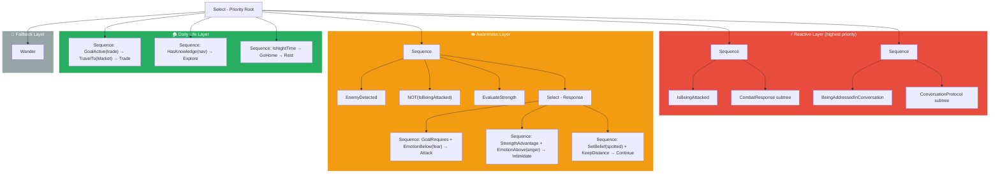
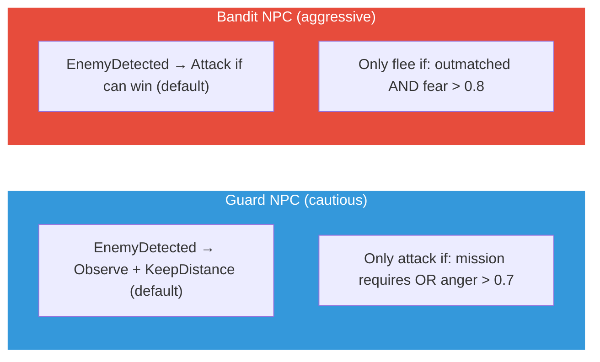

# Unified Behavior Tree Structure

Priority layers and how emotions/knowledge gate branches.

## How personality shapes the tree

The LLM generates different trees for different NPCs. The **structure itself** embodies personality:

**Key insight:** Personality is baked into tree structure at generation time. Emotions add runtime variation via condition gates.

**Status:** Planned (v2). Currently using separate combat_tree + life_tree with mode switching.
