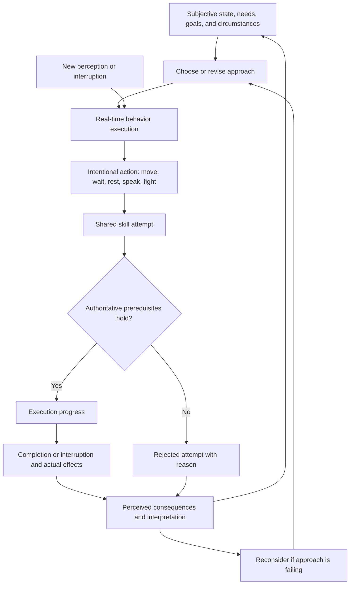

# Behavior execution and shared skills

**Current foundation flow (`m1-4`).** The LLM generates the actual policy. A bounded simulation-owned vocabulary supports reactive guards/priorities and persisted sequences, while shared skills execute below asynchronous reasoning. Legacy sequence data retains `bonsai-bt`. See [vision](../SIMULATION_VISION.md#behavior-execution-and-llm-reasoning).

```mermaid
flowchart TD
    State[Subjective state, needs, goals, and circumstances] --> Approach[Choose or revise approach]
    Approach --> Behavior[Real-time behavior execution]
    Perception[New perception or interruption] --> Behavior
    Behavior --> Intent[Intentional action: move, wait, rest, speak, fight]
    Intent --> Attempt[Shared skill attempt]
    Attempt --> Check{Authoritative prerequisites hold?}
    Check -->|No| Failure[Rejected attempt with reason]
    Check -->|Yes| Progress[Execution progress]
    Progress --> Result[Completion or interruption and actual effects]
    Result --> Experience[Perceived consequences and interpretation]
    Failure --> Experience
    Experience --> State
    Experience --> Reconsider[Reconsider if approach is failing]
    Reconsider --> Approach
```

Priority layers for reactivity, awareness, and goal pursuit remain useful. Waiting should carry a purpose and reconsideration conditions; random wandering is not proof of an intentional fallback. Human-controlled requests use the same skill lifecycle, without requiring the simulation to choose the human's intentions.

The [reactive runtime](../REACTIVE_POLICIES.md) retains the installed policy across damage and pending requests. Damage interrupts the active skill; next-tick guards read the new subjective experience. Policy replacement changes its generation. See [ADR 011](../adr/011-persistent-reactive-policies.md) and [verification](../REACTIVE_POLICY_VERIFICATION.md).

**Legacy prototype gap:** `evaluate_tree` returns only the last selected child action for `Sequence`; the tick executes that one action. A sequence such as travel → gather → eat does not currently demonstrate completed sequential actions. Correct persistent progress, completion/failure, and interruption semantics before using multi-action diagrams as implementation evidence. See [G2](../CURRENT_STATE.md#gaps-to-close).
