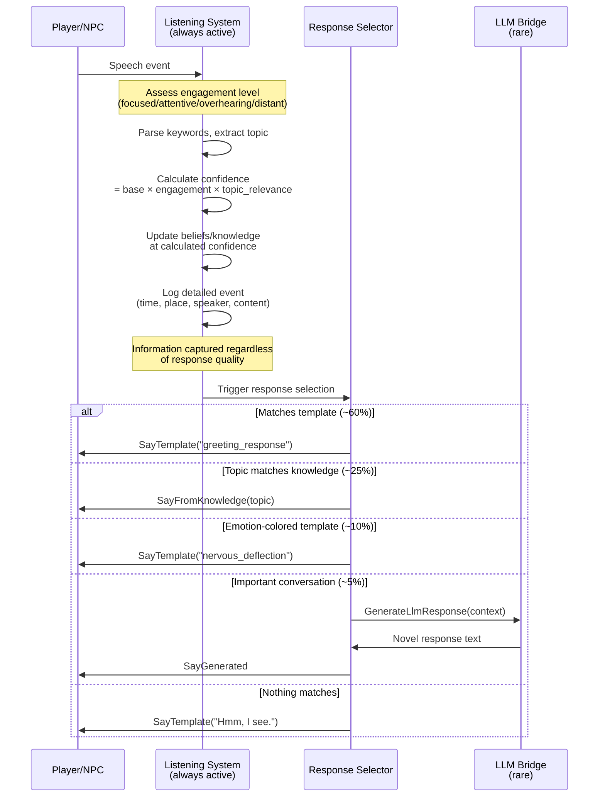
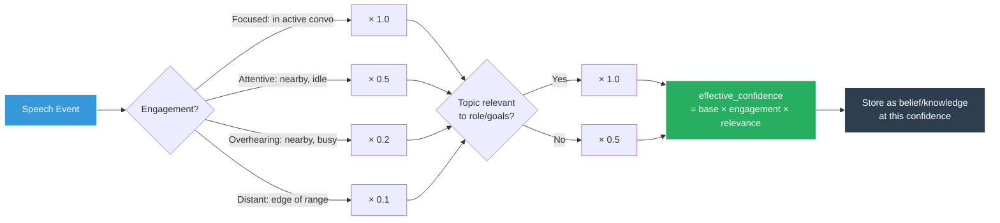
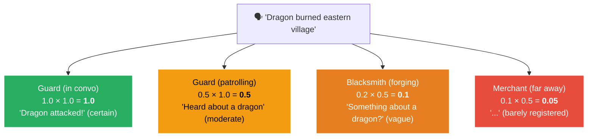

# Conversation Protocol

How NPCs handle conversations within the behavior tree. Listening is separated from responding — information is never lost by giving a template response.

## Engagement Confidence Calculation

### Worked Example

"The dragon burned down the eastern village" spoken in Market Square:

**Status:** Planned (v2). Currently conversations trigger a "social" decision type that calls the LLM for every response.
