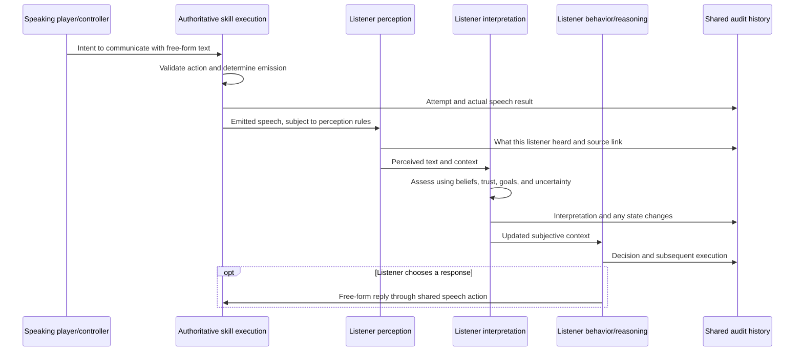

# Free-form communication

**First-slice target**, replacing the old template-percentage model. See [vision](../SIMULATION_VISION.md#communication-from-the-first-slice) and [acceptance checks](../AUDIT_AND_EXPERIMENTS.md#acceptance-checks).

```mermaid
sequenceDiagram
    participant S as Speaking player/controller
    participant A as Authoritative skill execution
    participant P as Listener perception
    participant I as Listener interpretation
    participant B as Listener behavior/reasoning
    participant H as Shared audit history
    S->>A: Intent to communicate with free-form text
    A->>A: Validate action and determine emission
    A->>H: Attempt and actual speech result
    A->>P: Emitted speech, subject to perception rules
    P->>H: What this listener heard and source link
    P->>I: Perceived text and context
    I->>I: Assess using beliefs, trust, goals, and uncertainty
    I->>H: Interpretation and any state changes
    I->>B: Updated subjective context
    B->>H: Decision and subsequent execution
    opt Listener chooses a response
        B->>A: Free-form reply through shared speech action
    end
```

A listener may misunderstand, disbelieve, ignore, or later forget a claim. Free expression is required; templates may be conveniences but cannot bound possible content. Claims do not directly rewrite world facts. Internal structured records and validation remain compatible with natural language.

Nearby friendly players must not silently inherit beliefs as though they conversed. Current automatic propagation and template-heavy defaults are [implementation gaps](../CURRENT_STATE.md), not the intended protocol.
