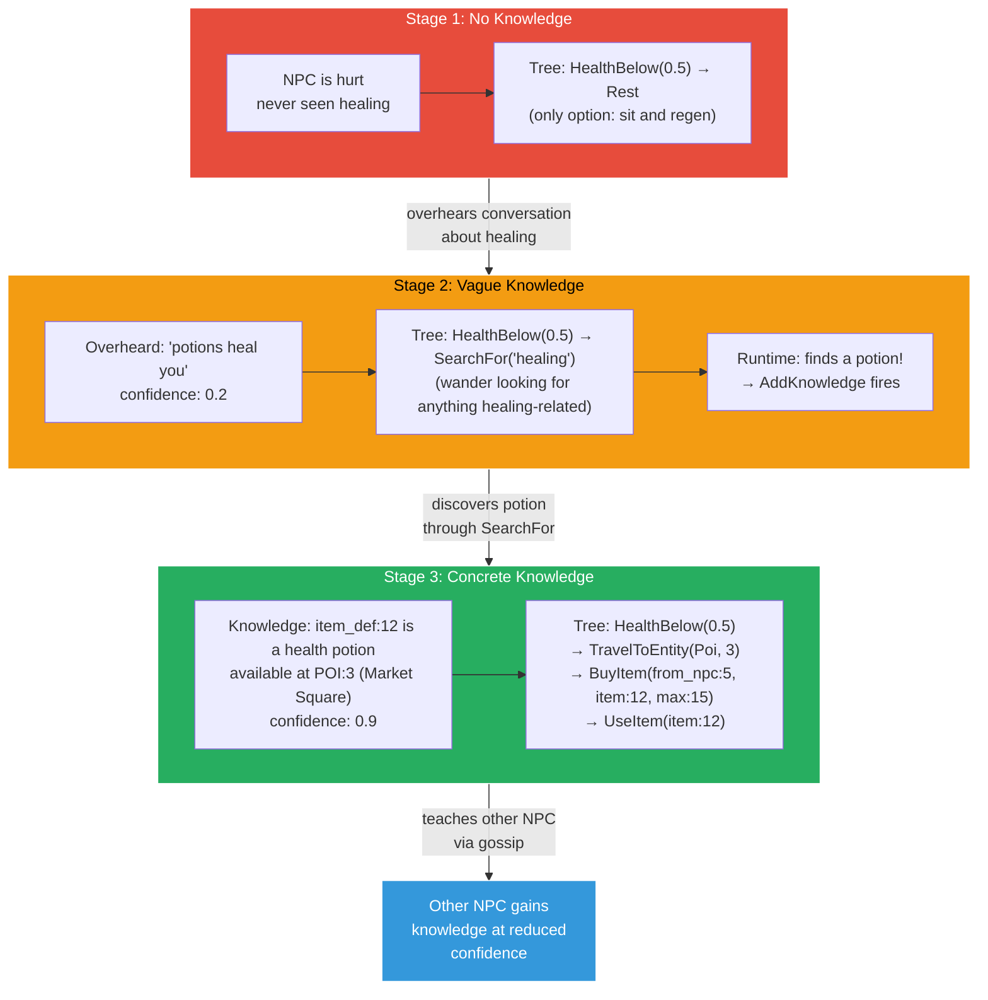
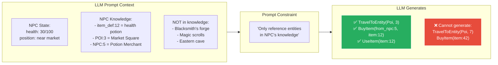
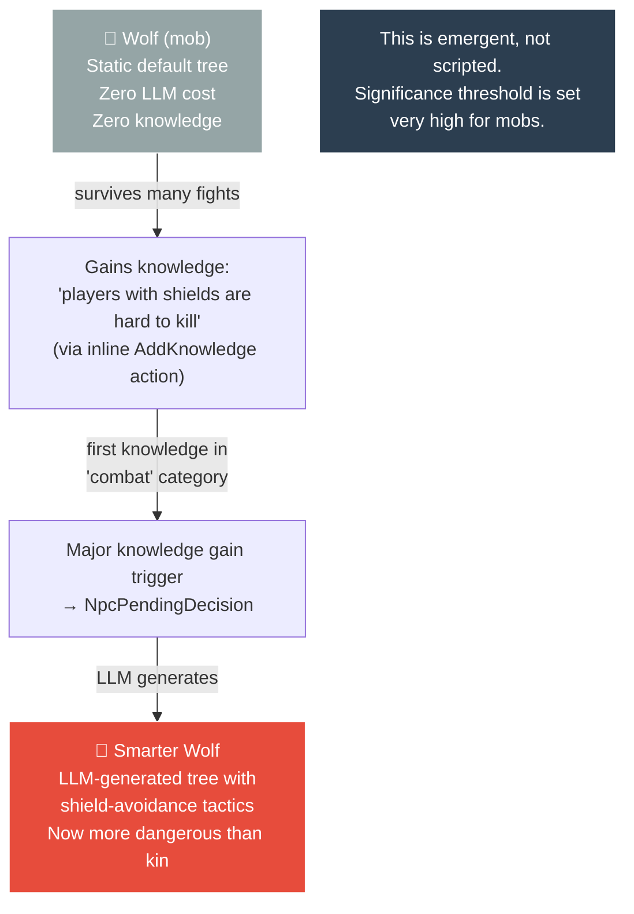

# Knowledge-Gated Action Progression

How NPCs progress from vague to concrete actions as they learn through experience.

## How knowledge gates the LLM prompt

## The mob learning path

**Status:** Planned (v2). Requires NpcKnowledge table, SearchFor runtime resolution, and knowledge-gated LLM prompt constraints.
