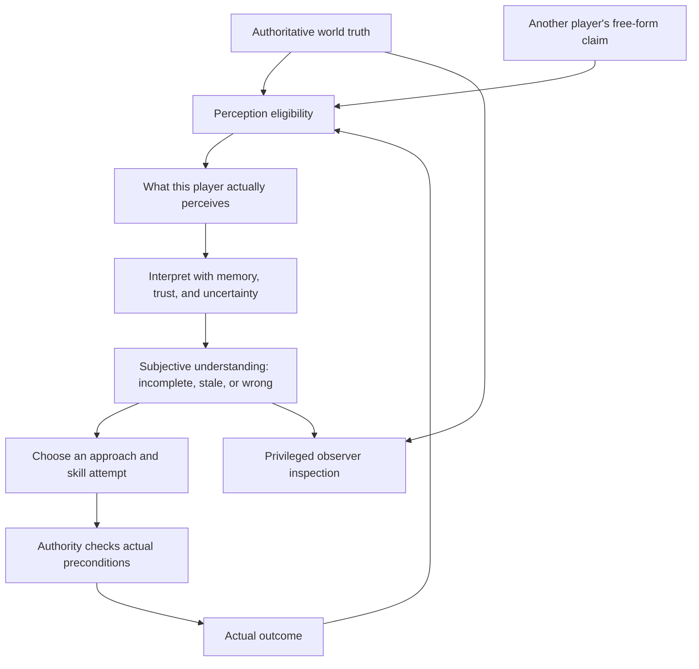

# Perception and subjective understanding

**Target boundary.** Knowledge and beliefs inform choices without becoming world truth. See [vision](../SIMULATION_VISION.md#truth-perception-and-subjective-understanding).

```mermaid
flowchart TD
    Truth[Authoritative world truth] --> Filter[Perception eligibility]
    Speech[Another player's free-form claim] --> Filter
    Filter --> Perceived[What this player actually perceives]
    Perceived --> Interpret[Interpret with memory, trust, and uncertainty]
    Interpret --> Belief[Subjective understanding: incomplete, stale, or wrong]
    Belief --> Decide[Choose an approach and skill attempt]
    Decide --> Validate[Authority checks actual preconditions]
    Validate --> Result[Actual outcome]
    Result --> Filter
    Truth --> Observer[Privileged observer inspection]
    Belief --> Observer
```

Example, not a fixed scenario: one player hears a food source is safe, another remembers danger there, and the authority records its actual condition. Either can act on imperfect information. Learning the result requires perception; the observer's comparison must not be copied into either controller's prompt.

Known entity references and the authority's existence/capability checks are separate concerns. Learning can broaden approaches, but a belief cannot grant an unavailable skill or invent an effect. The exact knowledge/belief schema and confidence update rules remain open. Existing proximity-based copying and incomplete model context are documented in [current state](../CURRENT_STATE.md).
