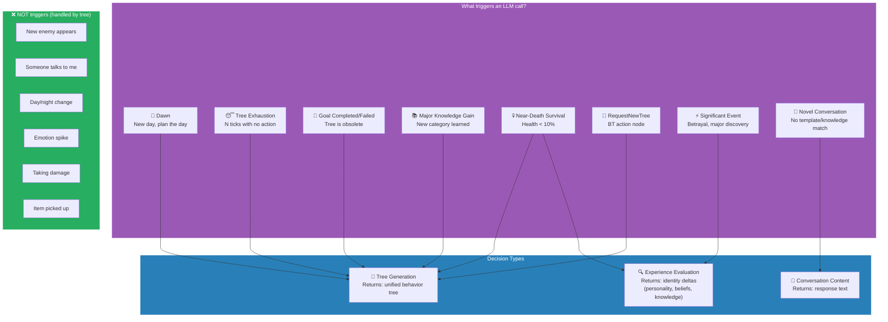
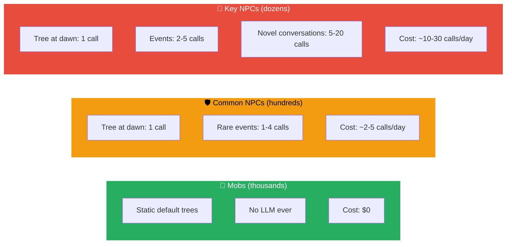
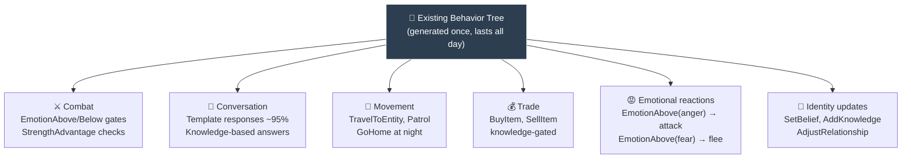

# When the LLM Is Called

All paths that lead to an LLM call, and the cost model.

## Cost Model

## What the tree handles without LLM

**Status:** Currently using v1 decision types (8 types, more LLM calls). Target v2 simplifies to 3 types with much lower call volume.
