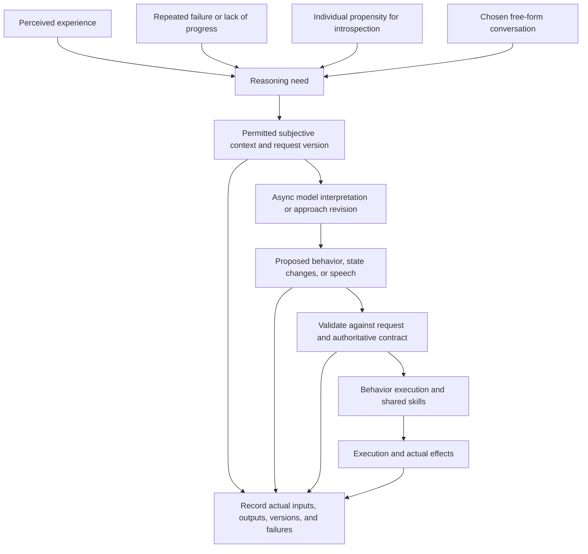

# LLM reasoning above behavior execution

**Target responsibilities**, not fixed call quotas or an exhaustive trigger implementation. Current bridge routes are `tree_generation`, `experience`, and `conversation`. See [bridge guidance](../../server/bridge/CLAUDE.md) for source/configuration and [vision](../SIMULATION_VISION.md#behavior-execution-and-llm-reasoning) for direction.

```mermaid
flowchart TD
    Experience[Perceived experience] --> Need[Reasoning need]
    Progress[Repeated failure or lack of progress] --> Need
    Self[Individual propensity for introspection] --> Need
    Conversation[Chosen free-form conversation] --> Need
    Need --> Context[Permitted subjective context and request version]
    Context --> LLM[Async model interpretation or approach revision]
    LLM --> Output[Proposed behavior, state changes, or speech]
    Output --> Authority[Validate against request and authoritative contract]
    Authority --> Behavior[Behavior execution and shared skills]
    Context --> Audit[Record actual inputs, outputs, versions, and failures]
    Output --> Audit
    Authority --> Audit
    Behavior --> Evidence[Execution and actual effects]
    Evidence --> Audit
```

Real-time activity and reactivity stay in the behavior layer while a model call is pending. The execution/recovery contract must make waiting, failure, and fallback explicit. Individual variation in introspection is required; the relationship to personality, self-awareness, or intelligence is open.

Measure latency, cost, and behavior quality in the small proof. Do not assume common versus key NPC tiers, fixed daily call counts, or “rare novel speech” percentages. Retain concise reported explanations without treating them as causal proof or hidden chain-of-thought. See [experiment/replay limits](../AUDIT_AND_EXPERIMENTS.md#fresh-experiments-versus-recorded-decision-replay).
