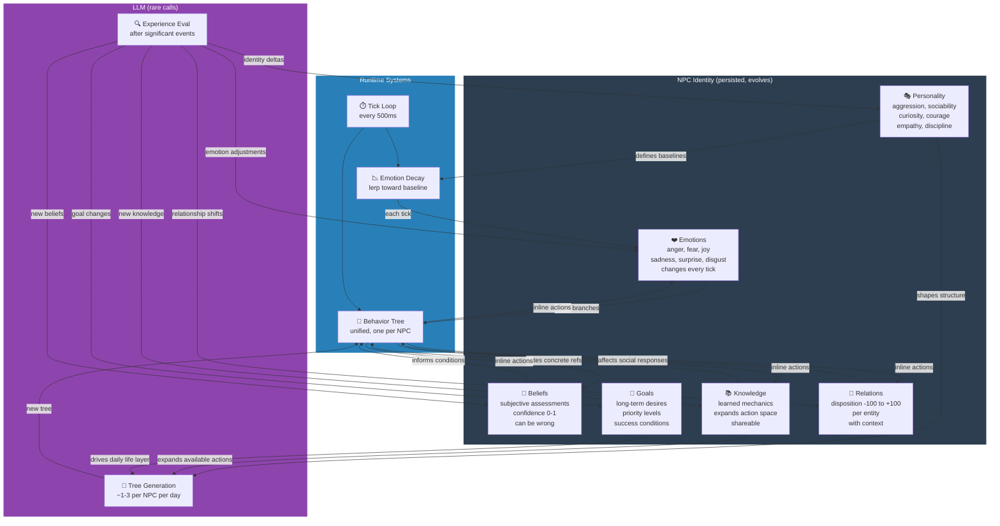

# NPC Identity Model

Six identity components and how they relate to each other and the behavior tree.

**Status:** Personality, Knowledge, and Emotions tables are planned (v2). Beliefs, Goals, and Relations are implemented (v1). Inline BT identity actions are partially implemented (SetBelief exists, AddKnowledge/TriggerEmotion planned).
