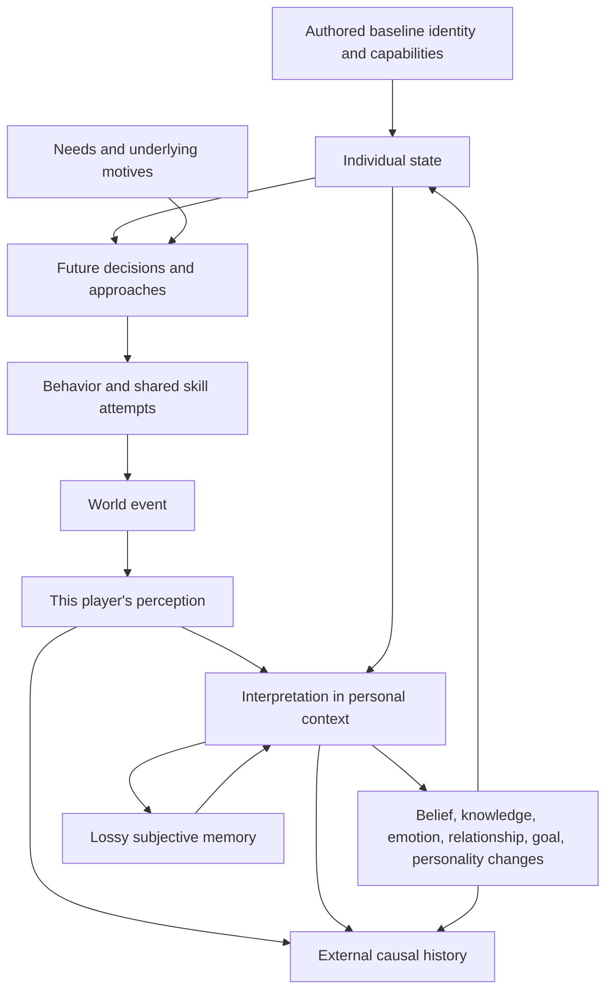

# Individual identity through experience

**Target model**, not a claim that all fields already feed decisions. See [vision](../SIMULATION_VISION.md#individuals-become-different-through-living) and [current gaps](../CURRENT_STATE.md).

```mermaid
flowchart TD
    Baseline[Authored baseline identity and capabilities] --> Individual[Individual state]
    World[World event] --> Perception[This player's perception]
    Perception --> Interpret[Interpretation in personal context]
    Individual --> Interpret
    Interpret --> Change[Belief, knowledge, emotion, relationship, goal, personality changes]
    Change --> Individual
    Individual --> Decision[Future decisions and approaches]
    Needs[Needs and underlying motives] --> Decision
    Decision --> Skills[Behavior and shared skill attempts]
    Skills --> World
    Perception --> History[External causal history]
    Interpret --> History
    Change --> History
    Memory[Lossy subjective memory] --> Interpret
    Interpret --> Memory
```

An authored role or category supplies a beginning, not a destiny or a root motive. Different players can interpret the same event differently. Experience-driven individual change is part of the first proof; not every event must alter every trait.

The external history retains evidence even when memory changes or the individual dies. Initially death is permanent; survivors change only through their own perceptions or later reports. Reincarnation and souls are deferred. This diagram does not impose simulated human psychology.
