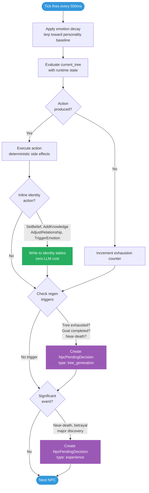
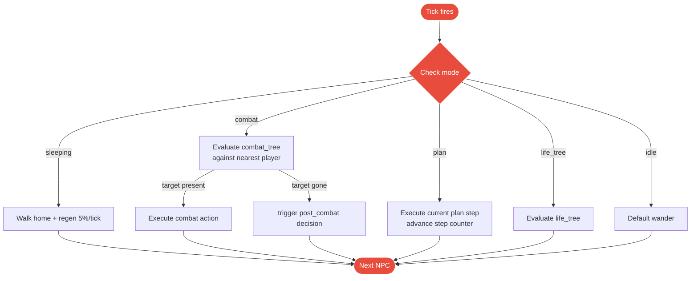

# NPC Tick Loop

What happens every 500ms for each NPC.

## Target (v2)

## Current (v1)

**Status:** Currently using v1 (mode switching). Migration to v2 (unified tree + emotion decay) is the primary next step.
