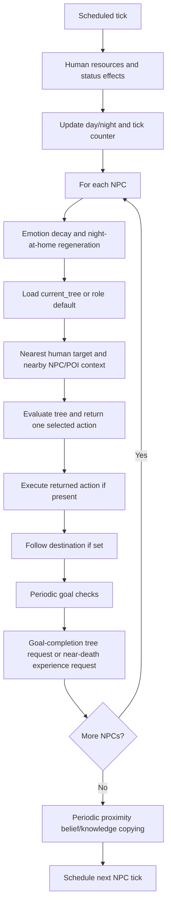

# Legacy NPC tick: static source reference

The implemented M1 path has its own authoritative step reducer; see [ADR 008](../adr/008-m1-authoritative-survival-slice.md). This diagram preserves the legacy gameplay path.

**Legacy source flow at `1736fc1` (2026-09-04), not runtime verification.** Based on `tick_npcs` in [lib.rs](../../server/module/spacetimedb/src/lib.rs) and helpers in [npc_ai.rs](../../server/module/spacetimedb/src/npc_ai.rs). Current scheduling targets 500 ms; this is a code setting, not a fixed product requirement.

```mermaid
flowchart TD
    Start[Scheduled tick] --> Resources[Human resources and status effects]
    Resources --> Day[Update day/night and tick counter]
    Day --> Each[For each NPC]
    Each --> Emotion[Emotion decay and night-at-home regeneration]
    Emotion --> Tree[Load current_tree or role default]
    Tree --> Context[Nearest human target and nearby NPC/POI context]
    Context --> Eval[Evaluate tree and return one selected action]
    Eval --> Execute[Execute returned action if present]
    Execute --> Destination[Follow destination if set]
    Destination --> Goals[Periodic goal checks]
    Goals --> Pending[Goal-completion tree request or near-death experience request]
    Pending --> More{More NPCs?}
    More -->|Yes| Each
    More -->|No| Copy[Periodic proximity belief/knowledge copying]
    Copy --> Next[Schedule next NPC tick]
```

The propagation check is after the NPC loop. Dawn and explicit action requests provide other decision paths; comments mentioning exhaustion are not a completed detector in this tick.

This flow does not implement the full target [behavior/skill lifecycle](behavior-tree.md). In particular, `Sequence` returns its last selected action without executing earlier ones; NPC combat has a separate effect path; copying records is not chosen conversation; human death respawns while NPC death removes live/history records. The [current-state assessment](../CURRENT_STATE.md) details these gaps and the [roadmap](../TODO.md) orders their resolution.
