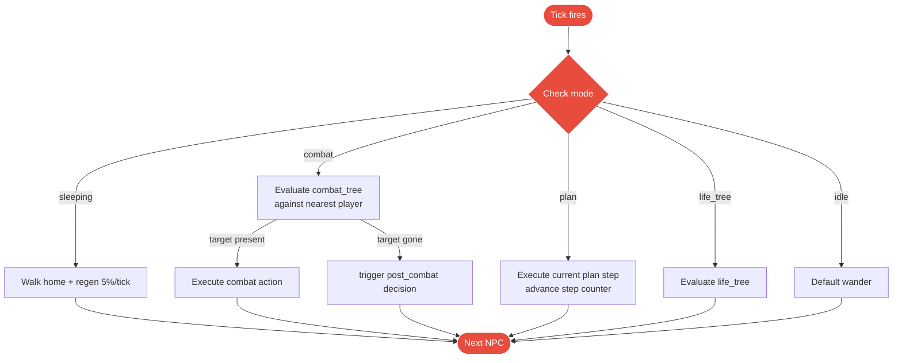

# NPC Tick Loop

What happens every 500ms for each NPC.

## Current Implementation (v2)

```mermaid
flowchart TD
    Start([Tick fires every 500ms]) --> Decay[1. Apply emotion decay<br/>lerp toward personality baseline]
    Decay --> NightRegen{Night + at home?}
    NightRegen -->|Yes| Regen2[2. Night regen<br/>5% HP/MP/SP]
    NightRegen -->|No| Eval
    Regen2 --> Eval[3. Evaluate unified current_tree<br/>with runtime state]
    Eval --> Action{Action<br/>produced?}

    Action -->|Yes| Exec[4. Execute action<br/>deterministic side effects]
    Action -->|No| FollowDest

    Exec --> InlineID{Inline identity<br/>action?}
    InlineID -->|SetBelief, AddKnowledge<br/>AdjustRelationship, TriggerEmotion| UpdateID[Write to identity tables<br/>zero LLM cost]
    InlineID -->|No| FollowDest

    UpdateID --> FollowDest[5. Follow NpcDestination<br/>move toward target]
    FollowDest --> GoalCheck{6. Every 5 ticks:<br/>check_goal_conditions}

    GoalCheck --> RegenCheck{7. Goal just<br/>completed?}
    RegenCheck -->|Yes| TreeRegen[Create NpcPendingDecision<br/>type: tree_generation]
    RegenCheck -->|No| NearDeath

    TreeRegen --> NearDeath{8. Near-death<br/>+ recent damage?}
    NearDeath -->|Yes| ExpEval[Create NpcPendingDecision<br/>type: experience]
    NearDeath -->|No| Propagate

    ExpEval --> Propagate[9. Every 10 ticks:<br/>propagate_beliefs_and_knowledge]
    Propagate --> Done([Next NPC])

    style Start fill:#3498db,stroke:#fff,color:#fff
    style Done fill:#3498db,stroke:#fff,color:#fff
    style TreeRegen fill:#9b59b6,stroke:#fff,color:#fff
    style ExpEval fill:#9b59b6,stroke:#fff,color:#fff
    style UpdateID fill:#27ae60,stroke:#fff,color:#fff
```

## Previous Implementation (v1 — replaced)

Click to expand v1 diagram (historical reference)

```mermaid
flowchart TD
    Start([Tick fires]) --> Mode{Check mode}

    Mode -->|sleeping| Sleep[Walk home + regen 5%/tick]
    Mode -->|combat| Combat[Evaluate combat_tree<br/>against nearest player]
    Mode -->|plan| Plan[Execute current plan step<br/>advance step counter]
    Mode -->|life_tree| Life[Evaluate life_tree]
    Mode -->|idle| Idle[Default wander]

    Combat -->|target gone| PostCombat[trigger post_combat decision]
    Combat -->|target present| ExecCombat[Execute combat action]

    Sleep --> Done([Next NPC])
    ExecCombat --> Done
    PostCombat --> Done
    Plan --> Done
    Life --> Done
    Idle --> Done

    style Start fill:#e74c3c,stroke:#fff,color:#fff
    style Mode fill:#e74c3c,stroke:#fff,color:#fff
    style Done fill:#e74c3c,stroke:#fff,color:#fff
```

