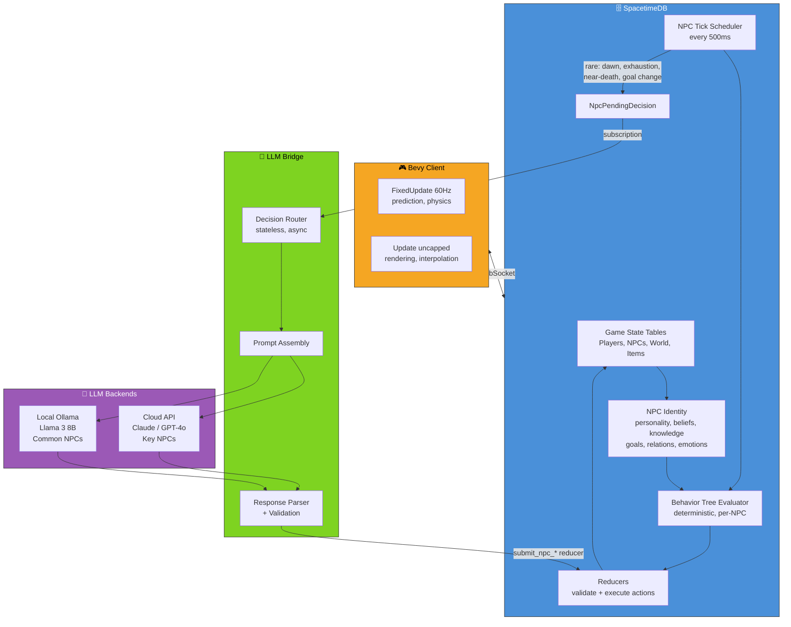

# System Overview

Three-tier architecture: Bevy Client ↔ SpacetimeDB ↔ LLM Bridge ↔ LLM backends.

**Status:** Reflects current implementation. The bridge currently routes 8 decision types (combat_start, combat_update, post_combat, idle, social, reflection, dawn, significant). Target v2 simplifies to 3 (tree_generation, experience, conversation).
