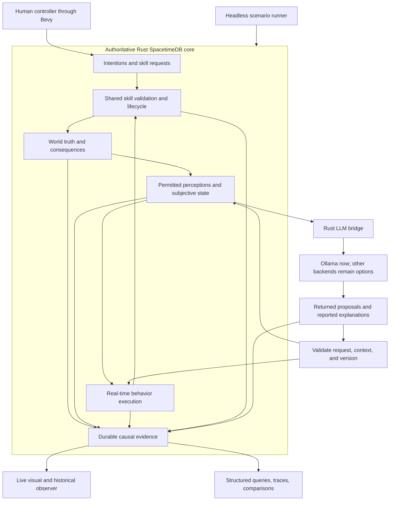

# System overview

**Target responsibilities on the retained stack.** Observer, evidence, shared-skill, and scenario components are requirements, not implemented claims. See [vision](../SIMULATION_VISION.md), [current state](../CURRENT_STATE.md), and [audit/experiments](../AUDIT_AND_EXPERIMENTS.md).

```mermaid
flowchart TD
    Human[Human controller through Bevy] --> Intent[Intentions and skill requests]
    subgraph Core[Authoritative Rust SpacetimeDB core]
        Context[Permitted perceptions and subjective state]
        Behavior[Real-time behavior execution]
        Skills[Shared skill validation and lifecycle]
        World[World truth and consequences]
        Audit[Durable causal evidence]
        Intent --> Skills
        Context --> Behavior
        Behavior --> Skills
        Skills --> World
        World --> Context
        World --> Audit
        Context --> Audit
        Behavior --> Audit
        Skills --> Audit
    end
    Context --> Bridge[Rust LLM bridge]
    Bridge --> Model[Ollama now; other backends remain options]
    Model --> Proposal[Returned proposals and reported explanations]
    Proposal --> Validate[Validate request, context, and version]
    Validate --> Behavior
    Validate --> Context
    Proposal --> Audit
    Runner[Headless scenario runner] --> Core
    Audit --> Visual[Live visual and historical observer]
    Audit --> Structured[Structured queries, traces, comparisons]
```

The runner initializes multiple isolated core instances/runs; the concrete isolation mechanism is open. Observation can expose privileged truth, but has no return path that supplies that truth to a character's context. Model request/response validation and authoritative skill effects remain separate boundaries.
